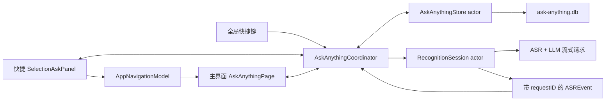
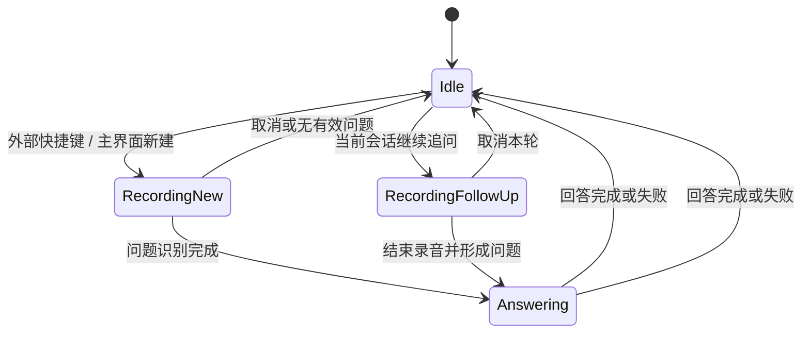

# Type4Me Ask Anything 历史会话开发设计文档

> 文档状态：设计完成，待实现
> 上游文档：`docs/ask-anything-conversation-history-prd.md`
> 适用平台：macOS 14+
> 技术栈：Swift 6.2、SwiftUI、AppKit、Observation、SQLite
> 最后更新：2026-08-10

---

## 1. 设计目标

本设计在不改变 Ask Anything 首次提问路径的前提下，增加：

1. 会话与轮次的本地持久化；
2. Type4Me 主界面中的历史会话页面；
3. 从历史会话继续语音追问；
4. 快捷面板与主界面的实时状态共享；
5. 搜索、重命名、复制和删除；
6. 历史保存开关、清空和隐私保护；
7. 可测试的会话状态机和请求关联机制。

设计必须保持以下既有行为：

- Ask Anything 面板可通过全局快捷键快速唤起；
- 面板可见时再次按快捷键控制当前追问；
- 追问录音中 ESC 取消本轮，空闲时 ESC 关闭面板；
- `RecordingControlCoordinator` 仍优先将活动追问动作交给 Ask Anything；
- 标准录音中的 ESC 仍只取消文本注入，不取消历史保存；
- 隐藏面板时不得运行无意义的无限动画。

---

## 2. 当前实现基线

| 当前组件 | 文件 | 当前职责 | 本项目影响 |
|---|---|---|---|
| `SelectionAskState` | `Type4Me/UI/SelectionAsk/SelectionAskController.swift` | 保存当前问题、选中文本、轮次和追问状态 | 状态上移到共享协调器 |
| `SelectionAskController` | 同上 | 创建和控制 `NSPanel`，处理追问按钮与 ESC | 退化为面板展示适配器 |
| `SelectionAskView` | `Type4Me/UI/SelectionAsk/SelectionAskView.swift` | 渲染当前内存会话 | 改为读取共享会话视图模型 |
| `RecognitionSession` | `Type4Me/Session/RecognitionSession.swift` | ASR、Prompt 构造、流式 LLM 和事件发射 | 接收结构化请求上下文并携带请求 ID 发事件 |
| `RecordingControlCoordinator` | `Type4Me/Type4MeApp.swift` | 在追问和标准录音之间路由结束/取消动作 | 改为依赖共享 Ask Anything 协调器 |
| `SettingsView` | `Type4Me/UI/Settings/SettingsView.swift` | 主窗口侧边栏和页面切换 | 新增一级 Ask Anything 页面和可外部控制的导航模型 |
| `HistoryStore` | `Type4Me/Database/HistoryStore.swift` | `recognition_history` SQLite 存储 | 不扩展其业务模型，仅复用 SQLite 实现模式 |

当前 `SelectionAskState.turns` 是唯一会话数据源；`RecognitionSession` 通过字符串形式的 `pendingSelectionAskConversationContext` 接收追问上下文，ASR 事件不携带会话或轮次标识。引入持久化和第二个展示界面后，这些假设不再成立。

---

## 3. 总体架构



### 3.1 核心约束

- `AskAnythingCoordinator` 是会话运行时状态的唯一所有者；
- `AskAnythingStore` 是持久化状态的唯一写入口；
- 快捷面板和主页面只发送用户意图，不直接修改会话数组；
- 每次模型请求必须由稳定的 `requestID`、`sessionID` 和 `turnID` 关联；
- 迟到的流式增量不得写入新的会话或轮次；
- 同一时刻只允许一个活动录音或模型请求；
- 数据库失败不得阻塞当前回答，但必须向用户呈现“未保存”状态；
- 所有正文仅进入本地数据库和用户配置的模型请求，不进入生产日志。

---

## 4. 新增模块

建议新增目录：

```text
Type4Me/
├── Database/
│   └── AskAnythingStore.swift
├── Services/
│   ├── AskAnythingCoordinator.swift
│   └── AskAnythingContextBuilder.swift
└── UI/
    ├── SelectionAsk/
    │   ├── SelectionAskController.swift
    │   └── SelectionAskView.swift
    └── Settings/
        └── AskAnything/
            ├── AskAnythingPage.swift
            ├── AskAnythingConversationList.swift
            ├── AskAnythingConversationDetail.swift
            └── AskAnythingFollowUpBar.swift
```

测试文件：

```text
Type4MeTests/
├── AskAnythingStoreTests.swift
├── AskAnythingCoordinatorTests.swift
├── AskAnythingContextBuilderTests.swift
└── SelectionAskControllerTests.swift
```

---

## 5. 领域模型

### 5.1 会话

```swift
struct AskAnythingSession: Identifiable, Equatable, Sendable {
    enum Status: String, Codable, Sendable {
        case active
        case answering
        case failed
    }

    let id: UUID
    var title: String
    var usesCustomTitle: Bool
    var sourceText: String
    var createdAt: Date
    var updatedAt: Date
    var status: Status
}
```

说明：

- 草稿不持久化，因此没有 `draft` 数据库状态；
- “正在录音”是短暂运行时状态，不写入会话表；
- `usesCustomTitle` 防止后续逻辑覆盖用户重命名的标题；
- `sourceText` 保存首轮提问时冻结的选中文本；
- `updatedAt` 在新增轮次、回答完成、失败或重命名时更新。

### 5.2 轮次

```swift
struct AskAnythingTurn: Identifiable, Equatable, Sendable {
    enum Status: String, Codable, Sendable {
        case pending
        case streaming
        case completed
        case failed
        case interrupted
    }

    let id: UUID
    let sessionID: UUID
    let ordinal: Int
    var question: String
    var answer: String
    var status: Status
    var errorMessage: String?
    var createdAt: Date
    var updatedAt: Date
    var completedAt: Date?
}
```

### 5.3 聚合视图

```swift
struct AskAnythingConversation: Equatable, Sendable {
    var session: AskAnythingSession
    var turns: [AskAnythingTurn]
}
```

UI 使用聚合视图，数据库继续保持规范化表结构。

### 5.4 草稿与运行时状态

```swift
struct AskAnythingDraft: Equatable {
    var sourceText: String
    var recognizedQuestion: String = ""
}

enum AskAnythingActivity: Equatable {
    case idle
    case recordingNew(AskAnythingDraft)
    case recordingFollowUp(sessionID: UUID)
    case answering(sessionID: UUID, turnID: UUID, requestID: UUID)
}
```

`AskAnythingActivity` 只存在于 `@MainActor` 协调器中。数据库恢复时，任何残留的 `answering` / `streaming` 记录都转为 `interrupted`，不会自动重新请求模型。

---

## 6. SQLite 设计

### 6.1 数据库边界

新增独立数据库：

```text
~/Library/Application Support/Type4Me/ask-anything.db
```

选择独立数据库而不是扩展 `recognition_history` 的原因：

- Ask Anything 是多表、多轮次领域，生命周期不同于单条识别记录；
- 清空 Ask Anything 历史时不应影响识别历史；
- 未来同步、导出或加密可以独立演进；
- 避免 `HistoryStore` 继续承担不相关职责；
- 可以沿用现有 SQLite C API 和 actor 串行访问模式。

### 6.2 数据库初始化

```sql
PRAGMA foreign_keys = ON;
PRAGMA journal_mode = WAL;

CREATE TABLE IF NOT EXISTS ask_sessions (
    id TEXT PRIMARY KEY,
    title TEXT NOT NULL,
    uses_custom_title INTEGER NOT NULL DEFAULT 0,
    source_text TEXT NOT NULL DEFAULT '',
    status TEXT NOT NULL,
    created_at TEXT NOT NULL,
    updated_at TEXT NOT NULL
);

CREATE TABLE IF NOT EXISTS ask_turns (
    id TEXT PRIMARY KEY,
    session_id TEXT NOT NULL,
    ordinal INTEGER NOT NULL,
    question TEXT NOT NULL,
    answer TEXT NOT NULL DEFAULT '',
    status TEXT NOT NULL,
    error_message TEXT,
    created_at TEXT NOT NULL,
    updated_at TEXT NOT NULL,
    completed_at TEXT,
    FOREIGN KEY(session_id) REFERENCES ask_sessions(id) ON DELETE CASCADE,
    UNIQUE(session_id, ordinal)
);

CREATE INDEX IF NOT EXISTS idx_ask_sessions_updated
ON ask_sessions(updated_at DESC, id DESC);

CREATE INDEX IF NOT EXISTS idx_ask_turns_session_ordinal
ON ask_turns(session_id, ordinal ASC);
```

所有日期继续使用 ISO 8601 UTC 字符串，与 `HistoryStore` 保持一致。

### 6.3 Schema 版本

使用 `PRAGMA user_version` 管理迁移：

- `0 → 1`：创建首版表和索引；
- 每次迁移在显式事务内完成；
- 迁移失败保留旧数据库并让页面显示加载错误；
- 首版没有旧 Ask Anything 数据，不从 `SelectionAskState` 或识别历史迁移。

### 6.4 Store API

```swift
actor AskAnythingStore {
    func createConversation(
        session: AskAnythingSession,
        firstTurn: AskAnythingTurn
    ) throws

    func appendTurn(_ turn: AskAnythingTurn) throws
    func updateTurnAnswer(
        id: UUID,
        answer: String,
        status: AskAnythingTurn.Status,
        errorMessage: String?
    ) throws
    func fetchConversation(id: UUID) throws -> AskAnythingConversation?
    func fetchSessions(pageSize: Int, before: SessionCursor?) throws -> [AskAnythingSessionSummary]
    func searchSessions(query: String, limit: Int) throws -> [AskAnythingSessionSummary]
    func renameSession(id: UUID, title: String) throws
    func deleteSession(id: UUID) throws
    func deleteAll() throws
    func markUnfinishedTurnsInterrupted() throws
}
```

`createConversation` 必须在同一事务中插入会话和首轮，防止出现没有轮次的历史。

### 6.5 搜索方案

第一版采用参数化 `LIKE` 查询，不依赖 FTS 扩展：

```sql
SELECT DISTINCT s.*
FROM ask_sessions s
LEFT JOIN ask_turns t ON t.session_id = s.id
WHERE s.title LIKE ? ESCAPE '\'
   OR s.source_text LIKE ? ESCAPE '\'
   OR t.question LIKE ? ESCAPE '\'
   OR t.answer LIKE ? ESCAPE '\'
ORDER BY s.updated_at DESC
LIMIT ?;
```

要求：

- `%`、`_` 和 `\` 必须转义；
- 接受 SQLite 默认 `LIKE` 语义：ASCII 英文通常大小写不敏感，CJK 按实际字符序列匹配，不提供完整 Unicode case folding；
- 搜索输入防抖 200–300 ms；
- 空搜索恢复分页列表；
- 前置 `%` 无法使用普通 B-tree 文本索引；在 1,000 会话目标规模内接受全表扫描，超出性能预算后迁移到 FTS5；
- 不记录搜索正文到日志或遥测。

### 6.6 分页

使用 `(updated_at, id)` 复合游标，不使用不断增大的 offset：

```sql
WHERE updated_at < ? OR (updated_at = ? AND id < ?)
ORDER BY updated_at DESC, id DESC
LIMIT ?;
```

建议首屏 50 条，接近列表底部时加载下一页。

---

## 7. 统一会话协调器

### 7.1 职责

新增 `@MainActor @Observable final class AskAnythingCoordinator`，负责：

- 当前草稿、选中会话和活动会话；
- 快捷面板与主页面共同使用的会话快照；
- 新建、恢复、追问、结束和取消；
- 将 ASR/LLM 事件关联到正确轮次；
- 持久化调度与失败状态；
- 生成模型会话上下文；
- 历史保存开关；
- 删除活动会话保护；
- 向展示路由器暴露当前活动位置。

建议状态：

```swift
@MainActor
@Observable
final class AskAnythingCoordinator {
    private(set) var activity: AskAnythingActivity = .idle
    private(set) var activeConversation: AskAnythingConversation?
    private(set) var selectedSessionID: UUID?
    private(set) var persistenceError: String?
    private(set) var contextWasTruncated = false

    var historyEnabled: Bool
}
```

### 7.2 UI 意图 API

```swift
func beginNewQuestion(sourceText: String) -> Bool
func beginFollowUp(sessionID: UUID) -> Bool
func finishRecording() -> Bool
func cancelRecording() -> Bool
func selectSession(id: UUID) async
func createEmptyDraftForMainWindow()
func renameSession(id: UUID, title: String) async throws
func deleteSession(id: UUID) async throws
func clearHistory() async throws
```

视图不得直接操作 `turns` 数组。

### 7.3 事件 API

现有 `ASREvent.selectionAsk*` 缺少身份信息。改为：

```swift
case selectionAskStarted(
    requestID: UUID,
    question: String,
    selectedText: String
)
case selectionAskAnswerDelta(requestID: UUID, delta: String)
case selectionAskAnswerCompleted(requestID: UUID)
case selectionAskAnswerFailed(requestID: UUID, message: String)
```

协调器维护：

```swift
private var activeRequest: AskAnythingRequestBinding?

struct AskAnythingRequestBinding: Equatable {
    let requestID: UUID
    let sessionID: UUID
    let turnID: UUID
    let generation: Int
}
```

只有完全匹配当前绑定的事件才能修改当前轮次。迟到增量只记录不含正文的诊断信息并丢弃。

事件投递必须保持顺序。当前 App 层为每个 ASR event 单独创建 `Task { @MainActor in ... }` 的桥接方式不能继续用于 Ask Anything 流式事件，因为多个非结构化 Task 不提供业务顺序契约。实现时应任选一种串行方案：

- 将 Ask Anything event sink 定义为 async closure，并由 `RecognitionSession` 按产生顺序 `await`；或
- 建立单消费者 `AsyncStream<AskAnythingEvent>`，由一个长期 MainActor Task 顺序消费。

禁止为 started、delta、completed 分别启动互不关联的 MainActor Task。协调器收到 `selectionAskStarted` 时先建立内存轮次并发起事务写入；在首个数据库事务尚未完成时到达的 delta 继续更新内存，并在事务完成后由同一 request generation 的 flush 写入完整快照。

### 7.4 状态转换



会话可以在 `Answering` 时从快捷面板转移到主界面，但活动状态不改变。

---

## 8. RecognitionSession 改造

### 8.1 结构化请求上下文

移除只保存字符串的：

```swift
pendingSelectionAskConversationContext: String
```

替换为：

```swift
struct SelectionAskRequestContext: Sendable {
    let requestID: UUID
    let sessionID: UUID
    let turnID: UUID
    let sourceText: String
    let conversationContext: String
}
```

通过单次 actor 方法设置，避免多个字段跨 await 产生不一致：

```swift
func setSelectionAskRequestContext(_ context: SelectionAskRequestContext)
```

`completeSelectionAsk` 在开始时读取并清空该上下文，随后所有事件都携带同一个 `requestID`。

### 8.2 请求建立顺序

1. 协调器检查当前是否已有活动任务；
2. 开始录音并生成本轮 request token；
3. 录音完成后得到有效问题；
4. 协调器创建或追加本地轮次，状态为 `pending`；
5. 构建 `SelectionAskRequestContext`；
6. `RecognitionSession` 进入 `.postProcessing`；
7. 发射 `selectionAskStarted`；
8. LLM 增量经 `requestID` 路由；
9. 完成或失败事件更新内存和数据库；
10. 恢复 `RecognitionSession` 与协调器空闲状态。

如果本地持久化失败，回答仍可继续，但协调器标记本次会话“未保存”，不得假装已经进入历史。

### 8.3 错误事件

当前实现把用户可见错误作为普通回答增量发送。新设计必须使用独立失败事件，以便：

- 数据库将轮次标记为 `failed`；
- UI 使用错误样式；
- 后续追问不把错误文案当作助手有效回答写入上下文；
- 用户仍能看到问题和失败原因。

### 8.4 取消与 generation

现有 `SelectionAskFollowUpStartGate` 的 generation 防护保留，但归入协调器或由协调器持有。取消录音、关闭面板或切换任务时递增 generation，使尚未完成的 `awaitIdle` 和 actor 调用失效。

---

## 9. 会话上下文构建

新增纯函数组件 `AskAnythingContextBuilder`。它接收完整请求预算，而不是只限制历史字符串：

```swift
struct AskAnythingContextBuilder {
    struct Result: Equatable {
        let text: String
        let wasTruncated: Bool
        let includedTurnIDs: [UUID]
    }

    static func build(
        conversation: AskAnythingConversation,
        excluding pendingTurnID: UUID,
        currentQuestion: String,
        promptTemplateCharacters: Int,
        totalCharacterBudget: Int
    ) -> Result
}
```

规则：

1. 预算覆盖 Prompt 模板、当前问题、原始选中文本和历史轮次，不能只约束 conversation；
2. 固定模板和当前问题必须完整保留；
3. 原始选中文本优先保留，但超出剩余预算时按明确边界截断，并令 `wasTruncated = true`；
4. 原始选中文本继续通过 `{selected}` 独立传递，不重复拼入对话字符串；
5. 历史只包含 `completed` 轮次；`interrupted` 的部分回答保留在 UI 和数据库中，但不作为有效助手回答进入后续模型上下文；
6. `failed` 轮次的问题可以保留，但错误文案不得作为助手回答；
7. 从最近轮次向前装入剩余预算，再恢复为正序；
8. 不截断单个历史问题或回答的中间；
9. 预算优先来自已知 provider/model 上下文能力；无法获知时使用保守的 24,000 字符 fallback；字符数只是启发式安全边界，不是 token 的精确换算；
10. 返回 `wasTruncated`，驱动主界面非阻塞提示；
11. 不在日志中输出构建结果正文。

Prompt 继续使用 `SelectionAskPromptBuilder.requestText`，但调用方不再从 SwiftUI 状态临时拼接上下文。

---

## 10. 流式回答与持久化

### 10.1 内存更新

每个有效增量立即追加到协调器内存中的当前轮次，保证 UI 流畅。

### 10.2 数据库写入节流

不得为每个 token 发起一次 SQLite 写入。采用：

- 第一个非空增量将轮次改为 `streaming`；
- 后续增量以 500 ms 防抖或累计 1,000 字符为阈值写入；
- 完成、失败、面板转移和应用终止时强制 flush；
- flush 使用完整答案覆盖，不做增量 SQL 拼接；
- 旧 flush 任务带 request generation，不能覆盖新状态。

### 10.3 应用异常退出恢复

应用启动时调用：

```swift
try await store.markUnfinishedTurnsInterrupted()
```

将数据库中的 `pending` 和 `streaming` 轮次标记为 `interrupted`，保留已有回答。不会自动重放请求，避免重复计费和生成不同答案。

### 10.4 历史关闭

当 `tf_askAnythingHistoryEnabled == false`：

- 协调器仍创建内存会话和轮次；
- 所有 Store 写操作跳过；
- UI 显示临时会话标记；
- 打开主界面只能看到关闭开关前已有的历史；
- 临时会话关闭或应用退出后释放。

---

## 11. 面板层改造

### 11.1 SelectionAskController

`SelectionAskController` 不再拥有 `SelectionAskState` 的业务数据。它改为：

- 持有 `SelectionAskPanel`；
- 注入共享 `AskAnythingCoordinator`；
- 响应 show、hide、position 和 ESC；
- 将按钮动作转发给协调器；
- 将“在 Type4Me 中打开”转发给展示路由器；
- 保持 lazy 创建，避免启动时实例化隐藏 SwiftUI 动画树。

建议接口：

```swift
final class SelectionAskController {
    init(
        coordinator: AskAnythingCoordinator,
        onOpenInType4Me: @escaping (UUID) -> Void
    )

    var isVisible: Bool { get }
    func show()
    func hide()
    func handleEscape()
}
```

### 11.2 SelectionAskView

视图通过 Observation 读取协调器提供的当前会话快照。为了避免面板和主页面重复实现问答卡片，抽取：

- `AskAnythingSourceCard`；
- `AskAnythingTurnCard`；
- `AskAnythingRecordingControls`。

主页面可以使用更宽布局，但共享 Markdown 渲染、错误样式、复制按钮和加载状态。

### 11.3 隐藏性能

- `.idle` 状态不得显示 `ProgressView`；
- `VoiceBars` 只在可见且正在录音时挂载；
- panel `orderOut` 后不得存在持续动画；
- 不为读取快捷键提示而提前实例化 controller；
- 对此增加面板空闲状态单元测试或可观测状态断言。

---

## 12. 主界面导航与页面

### 12.1 SettingsTab

新增：

```swift
case askAnything
```

建议属性：

```swift
displayName: L("随便问", "Ask Anything")
subtitle: L("历史问答与持续追问", "Past questions and follow-ups")
icon: "text.bubble"
```

主导航顺序调整为：

```swift
[.general, .askAnything, .vocabulary, .history]
```

### 12.2 可外部控制的导航模型

当前 `SettingsView.selectedTab` 是局部 `@State`，外部无法定位页面或会话。新增：

```swift
@MainActor
@Observable
final class AppNavigationModel {
    var selectedTab: SettingsTab = .general
    var pendingAskAnythingSessionID: UUID?
}
```

由 `AppDelegate` 创建并注入主窗口：

```swift
SettingsView()
    .environment(appDelegate.navigationModel)
```

新增：

```swift
func presentAskAnything(sessionID: UUID?)
```

执行顺序：

1. 设置 `selectedTab = .askAnything`；
2. 设置待选中的 session ID；
3. 打开 settings window；
4. 激活 App；
5. 页面消费 session ID 并加载会话；
6. coordinator 将主要展示位置切到主界面；
7. 隐藏快捷面板。

“在 Type4Me 中打开”的 Tooltip 不使用按钮局部、越界后可能被裁切的 overlay；由 `SelectionAskView` 根层承载并置于内容之上。按钮从 SF Symbol 升级为 `type4me-wordmark-light.svg` / `type4me-wordmark-dark.svg` 横向字标，并由打包脚本复制到 App Bundle 的 `Contents/Resources/Assets`。

### 12.3 AskAnythingPage

页面负责：

- 加载分页会话摘要；
- 日期分组，以及组标题的折叠/展开状态；
- 搜索防抖；
- 列表选择；
- 会话详情和空状态；
- 重命名、复制和删除确认；
- 继续追问操作；
- 返回活动会话入口。

页面列表必须使用 `List` 或行级 `LazyVStack`。禁止在日期分组中使用普通 `VStack` 一次性构建整组行，避免重现识别历史列表的滚动性能问题。

日期组标题使用稳定分组标识维护折叠状态，并显示组内数量。折叠只影响行展示，不改变查询、分页游标或选中会话。标题按钮使用无按压态颜色变化的自定义 ButtonStyle；单个固定宽度 `chevron.down` 通过旋转表达折叠状态，禁止在两个宽度不同的 SF Symbol 之间替换，也不对整个标题行施加隐式动画。

会话详情时间必须显式采用 Type4Me 的应用内语言设置：中文使用 `zh_CN` Locale，英文使用 `en_US` Locale，不得依赖 macOS 当前系统 Locale。

列表点击可以立即更新目标 `selectedSessionID`，但详情区域应继续渲染 coordinator 当前持有的 `selectedConversation`，直到异步读取完成并由 coordinator 原位替换。不得用“目标 ID 与已加载详情 ID 暂时不一致”作为展示新建会话空状态的条件；只有 `selectedConversation == nil` 时才显示该空状态。

`SettingsView` 当前会把所有页面同时挂载在 `ZStack` 中，仅通过 `.opacity` 和 `.allowsHitTesting` 切换。因此 Ask Anything 页面必须接收 `isActive: Bool`，并遵守：

- 初始 `isActive == false` 时不执行首屏、分页或搜索查询；
- 变为 `true` 时才加载首屏并消费待定位的 session ID；
- 变为 `false` 时取消搜索防抖、分页和非必要刷新任务；
- Store 变更通知先 `guard isActive`，隐藏页面不得重载历史列表；
- 活动会话仍由共享 Coordinator 在后台推进，但隐藏页面不据此触发列表查询。

建议接入形式：

```swift
fixedPage(.askAnything) {
    AskAnythingPage(isActive: selectedTab == .askAnything)
}
```

### 12.4 展示位置

协调器维护：

```swift
enum AskAnythingPresentation {
    case panel
    case mainWindow
}
```

这只决定默认展示位置，不影响请求和持久化。转移到主窗口后面板隐藏，避免两个活动操作栏同时出现。

---

## 13. 录音路由

### 13.1 RecordingControlCoordinator

当前协调器依赖 `SelectionAskController.isRecordingFollowUp`。改为依赖 `AskAnythingCoordinator`：

```swift
final class RecordingControlCoordinator {
    private weak var askAnythingCoordinator: AskAnythingCoordinator?

    func perform(_ action: RecordingControlAction) {
        if askAnythingCoordinator?.handleActiveRecordingAction(action) == true {
            return
        }
        onStandardAction(action)
    }
}
```

这样即使快捷面板已经隐藏、用户在主界面追问，录制指示器和 ESC 仍能正确结束或取消 Ask Anything。

### 13.2 快捷键路由

Ask Anything mode 的热键按下时：

1. 若协调器正在 Ask Anything 录音，结束录音；
2. 若快捷面板可见且存在当前会话，开始追问；
3. 若主窗口 Ask Anything 页面处于前台且选中会话，开始该会话追问；
4. 若主窗口 Ask Anything 页面处于前台但没有选中会话，创建无选中文本的新会话草稿；
5. 若主窗口位于其他页面或用户位于其他 App，冻结真实的外部选中文本，创建新会话草稿并显示快捷面板；
6. 若其他标准模式正在录音，沿用现有冲突保护，不抢占或清空已录内容。

第 5 步不得把 Type4Me 主窗口列表或详情中的当前文本选择误当成外部 `sourceText`。

热键松开和重复事件继续由 `HotkeyManager` 的现有状态机吞并，不能在本功能中另建按键状态。

---

## 14. 并发、一致性与错误恢复

### 14.1 Actor 边界

- `AskAnythingCoordinator`：`@MainActor`，维护 UI 可观察状态；
- `AskAnythingStore`：actor，串行化 SQLite 操作；
- `RecognitionSession`：现有 actor，负责音频和模型请求；
- SwiftUI 视图：只在主线程读取协调器；
- Store 返回 `Sendable` 值类型，不返回 SQLite 指针或可变引用。

ASR/LLM 事件跨 actor 投递必须走单一串行事件通道，不能依赖多个非结构化 `Task` 恰好按创建顺序执行。

### 14.2 写入顺序

内存是实时 UI 的即时来源，数据库是可恢复来源。每次关键操作顺序：

1. 校验状态和 generation；
2. 更新内存；
3. 发起 actor 持久化；
4. 持久化失败时保留内存并显示未保存状态；
5. 不因一次数据库错误自动重试无限循环。

### 14.3 迟到事件

以下情况必须丢弃旧事件：

- 用户取消追问后 ASR 仍返回文本；
- 上一个请求完成事件晚于新会话开始；
- flush Task 在轮次已失败后才恢复；
- 会话被删除或清空后仍收到旧 delta。

判断依据是 `requestID + sessionID + turnID + generation`，不能仅凭“当前最后一轮”。

### 14.4 删除事务

- 删除单个会话依靠外键级联删除轮次；
- 删除前协调器检查是否为活动会话；
- 数据库成功后再从列表移除，避免永久操作的乐观 UI 回滚复杂度；
- `deleteAll` 在单个事务中执行；
- 清空后协调器释放非活动缓存，活动临时会话按产品确认结果处理。第一版要求清空前结束活动任务。

---

## 15. 隐私与安全

### 15.1 UserDefaults

新增：

```text
tf_askAnythingHistoryEnabled = true
```

开关只控制未来写入，不隐式删除已有数据库。

该开关与“清空全部历史”按钮放在 `ModesSettingsTab` 的内置“随便问”模式详情中。`AskAnythingPage` 不重复提供这两个设置入口。清空操作继续复用 Coordinator，并保留二次确认和活动任务禁用规则。

### 15.2 日志规则

允许记录：

- session ID、turn ID、request ID；
- 问题和回答字符数量；
- 状态转换；
- provider/model 标识；
- 错误类型和错误码。

禁止记录：

- `sourceText`；
- 用户问题；
- 模型回答；
- 完整 conversation context；
- 完整 Prompt；
- 搜索关键词。

当前 `completeSelectionAsk` 的调试日志会输出 question、selectedRaw 和完整 prompt。本项目实现时必须移除这些正文日志，改为字符数和标识符。

### 15.3 删除

SQLite 删除不承诺安全擦除磁盘块。产品文案使用“从 Type4Me 历史中删除”，不宣称法证级安全擦除。若未来加入高敏感模式，需要单独评估 SQLCipher 或整库文件保护。

---

## 16. 通知与列表刷新

Store 成功变更后发布：

```swift
extension Notification.Name {
    static let askAnythingStoreDidChange = Notification.Name(
        "Type4Me.askAnythingStoreDidChange"
    )
}
```

通知只作为非活动页面刷新信号，不携带正文。活动会话 UI 直接观察协调器，避免每个 delta 通过通知驱动整页查询。

主页面收到通知时：

- 若当前未搜索，刷新受影响的会话摘要；
- 若正在搜索，防抖后重新执行查询；
- 不在每次流式 flush 时重载完整列表。

---

## 17. 测试设计

### 17.1 AskAnythingStoreTests

覆盖：

- 首次建库和 schema version；
- 会话与首轮事务创建；
- 追加轮次和 ordinal 唯一性；
- 流式答案覆盖与状态更新；
- 会话重命名和 `usesCustomTitle`；
- 更新时间排序和复合游标分页；
- 标题、问题、回答和 sourceText 搜索；
- `%`、`_`、`\` 搜索转义；
- 删除会话级联删除轮次；
- `deleteAll`；
- 启动时将 pending/streaming 标为 interrupted；
- 并发 actor 调用不产生重复 ordinal。

### 17.2 AskAnythingCoordinatorTests

覆盖：

- 空录音不创建会话；
- 首轮问题创建会话和轮次；
- 面板可见时快捷键进入追问；
- 面板关闭后外部快捷键创建新会话；
- 主页面激活时追问选中会话；
- ESC 在录音与非录音状态下的不同语义；
- 结束/取消操作幂等；
- 数据库失败时回答继续但显示未保存；
- 历史关闭时不调用 Store 写入；
- 活动会话不能删除；
- requestID 不匹配的 delta、complete、failed 被丢弃；
- 从面板转移主窗口不重启请求；
- 应用恢复 interrupted 轮次；
- 流式 flush 防抖不会用旧答案覆盖新答案。

### 17.3 AskAnythingContextBuilderTests

覆盖：

- 正常多轮格式；
- 不重复 sourceText；
- 排除当前 pending turn；
- failed 错误文案不进入助手上下文；
- interrupted 的部分回答处理；
- 字符预算以内不裁剪；
- 超预算从最早完整轮次开始裁剪；
- 输出轮次顺序正确；
- `wasTruncated` 和 included IDs 正确。

### 17.4 UI 与回归测试

覆盖：

- 主导航出现 Ask Anything；
- 深度打开指定会话；
- 日期分组边界；
- 搜索空状态和加载状态；
- 删除确认和活动会话置灰；
- 中英文文案；
- VoiceOver 标签和键盘焦点；
- 1,000 个会话滚动压力测试；
- 隐藏面板没有持续动画和异常 CPU；
- 现有 `SelectionAskControllerTests`、`RecognitionSessionTests`、热键状态机测试全部通过；
- 标准录音 ESC 和历史保存行为无回归。

---

## 18. 实施阶段

### 阶段 A：领域模型与存储

- 实现模型、数据库、迁移、CRUD、搜索和分页；
- 完成 Store 单元测试；
- 不改 UI。

### 阶段 B：统一协调器

- 引入 `AskAnythingCoordinator`；
- 给事件和请求增加稳定 ID；
- 将面板状态迁移到协调器；
- 保持现有 UI 外观和行为；
- 完成状态机与回归测试。

### 阶段 C：主界面页面

- 新增导航模型和 Ask Anything 页面；
- 实现列表、详情、搜索、重命名、复制和删除；
- 实现旧会话追问。

### 阶段 D：跨界面与隐私

- 增加“在 Type4Me 中打开”；
- 完成展示位置转移；
- 增加历史保存开关和清空入口；
- 清理正文日志；
- 完成长会话裁剪提示。

### 阶段 E：验证与发布

- 全量测试；
- 1,000 会话性能测试；
- 多显示器、全屏 App、面板隐藏和 Dock accessory 模式验证；
- 应用异常退出恢复测试；
- 中英文和 VoiceOver 验收。

---

## 19. 完成定义

开发完成必须同时满足：

1. PRD 的 14 条验收标准全部通过；
2. 新增 Store、Coordinator 和 ContextBuilder 测试通过；
3. 现有 Ask Anything、RecognitionSession、热键和历史测试无回归；
4. 生产日志扫描确认不包含 Ask Anything 正文；
5. 1,000 个会话下首屏、分页、搜索和滚动达到可接受性能；
6. 面板隐藏后没有持续动画或明显 CPU 占用；
7. 应用退出或请求迟到时不会把回答写入错误会话；
8. 文档、中文文案和英文文案与实际实现一致。

---

## 20. 已确认技术决策

| 主题 | 决策 |
|---|---|
| 状态所有者 | 新增单一 `AskAnythingCoordinator` |
| 面板职责 | 仅负责 AppKit 展示和动作转发 |
| 主页面职责 | 历史浏览、搜索、管理和继续追问 |
| 数据库存储 | 独立 `ask-anything.db`，SQLite actor 访问 |
| 数据模型 | 规范化 session + turn 两表 |
| 请求关联 | requestID + sessionID + turnID + generation |
| 流式持久化 | 内存即时更新，500 ms 防抖并在终态强制 flush |
| 搜索 | 第一版参数化 LIKE，后续按性能迁移 FTS5 |
| 分页 | `(updated_at, id)` 复合游标 |
| 长上下文 | 保留原始选中文本与最近完整轮次，不做自动总结 |
| 外部导航 | 共享 `AppNavigationModel` 深度打开指定会话 |
| 历史关闭 | 保留内存会话，跳过新持久化，不删除旧数据 |
| 删除 | 活动会话禁止删除，数据库成功后再更新列表 |
| 迁移 | 无旧 Ask Anything 会话数据，不做内容迁移 |
