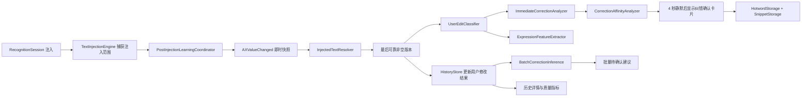
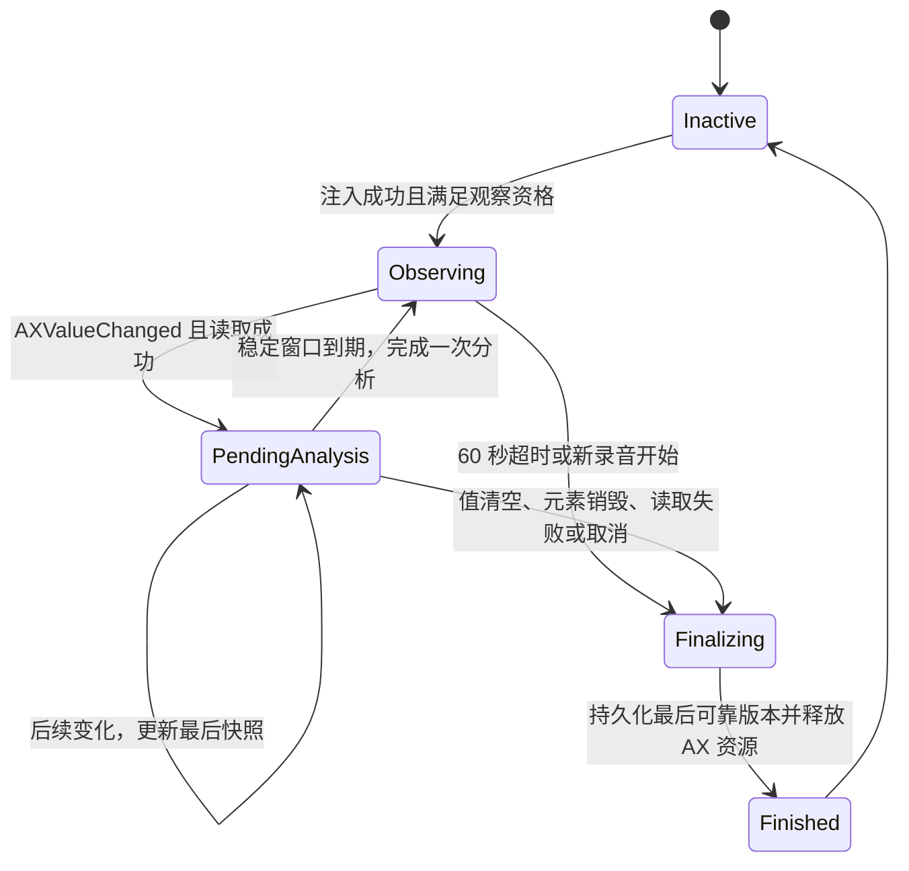

# Type4Me Intelli Sense 用户纠正文本识别开发设计文档

> 文档类型：专项开发设计
> 文档状态：当前有效（已实现，待 Beta 验证）
> 上游产品文档：`docs/features/intelli-sense/product-design.md`
> 上游开发设计：`docs/features/intelli-sense/development-design.md`
> 适用平台：macOS 14+
> 技术栈：Swift 6.2、AppKit、Accessibility API、NaturalLanguage、CppJieba、SQLite
> 设计日期：2026-08-11
> 最后校验：2026-08-12
> 实现基线：当前工作树（待合并）

产品界面和对外文案统一写作“Intelli Sense”；Swift 类型与文件名使用不含空格的 `IntelliSense`。

本文是 Intelli Sense 注入后观察、用户纠正文本识别和历史数据闭环的专项设计。涉及以下内容时，以本文为准：

- 用户编辑观察生命周期；
- 用户修改后文本的历史持久化；
- 中英文纠正候选识别；
- 即时候选与批量替换推断；
- 修改结果对表达习惯学习的供给方式。

本文不改变 Intelli Sense“只润色本次口述，不回答、不执行动作”的产品边界。

---

## 1. 执行摘要

旧版纠错词检测只在 Intelli Sense 注入后监听同一个 Accessibility 文本控件，并在 4 秒静默后比较控件全文。该实现能够识别少量理想的字符替换，但存在结构性低召回：

- 用户改完立即发送，输入框清空后才触发分析，修改结果丢失；
- 用户开始下一次录音时，上一观察器被直接取消；
- Codex、Dia、Lark 等应用的 `AXValue` 可能在编辑后变得不可读；
- 英文单词内部纯字母插入或删除被明确拒绝；
- 中文没有真正的分词或边界识别，单汉字纠正一律拒绝；
- 成功、超时、取消等路径缺少结构化结果，无法计算真实召回率；
- 用户修改后的文本只在内存中参与一次表达特征提取，不进入历史，后续无法离线重算。

本设计将能力升级为三层：

1. **可靠观察层**：每次 AX 变化立即捕获并保留最后一个可靠的非空快照，在清空、销毁、超时或新录音取消前统一结算；
2. **纠正识别层**：从“Type4Me 注入文本 → 用户修改文本”中区分词汇纠正、表达修改、内容修改和不确定修改；
3. **历史与推断层**：将可安全归属到本次注入片段的最后修改结果写入历史，为表达习惯重算、无需修改率和批量替换推断提供源数据。

历史记录形成三段链路：

```text
raw_text            ASR 原始识别结果
    ↓
final_text          Type4Me 实际注入结果
    ↓
user_edited_text    观察窗口内最后可靠的用户版本
```

`user_edited_text` 不表示用户在外部 App 中的绝对最终稿，只表示 Type4Me 在有限观察窗口内可靠捕获到的最后版本。

---

## 2. 目标与非目标

### 2.1 目标

1. 在聊天输入框被清空、控件销毁或下一次录音开始前保住最后一次有效编辑；
2. 提高英文拼写纠正、中英文技术词和中文专有名词纠正的召回率；
3. 不把普通内容改写、事实变化或输入法组合过程误学成全局替换；
4. 将用户修改后的可靠结果与对应历史记录关联；
5. 支持历史页面回溯 Type4Me 输出与用户修改结果；
6. 为表达习惯离线重算、编辑距离评估和批量纠错推断预埋稳定数据；
7. 所有全局热词和片段映射仍需用户确认；
8. 不新增网络请求，不使用 LLM 实时判断纠正候选。

### 2.2 非目标

- 不监控非 Type4Me 注入的普通键盘输入；
- 不观察其他 App、其他窗口或非目标输入控件；
- 不保存目标控件的完整正文；
- 不把用户每一次修改都解释成“ASR 错词”；
- 不从一次修改直接生成永久表达偏好；
- 不自动写入全局热词或片段映射；
- 不在本阶段实现云端个性化训练；
- 不保证捕获用户离开 60 秒观察窗口后的继续编辑；
- 不把输入框清空确定性描述为“消息已发送”。

---

## 3. 术语与数据语义

| 术语 | 定义 |
|---|---|
| 注入文本 | 本次 `TextInjectionEngine` 实际粘贴到目标控件的 `final_text` |
| 基线控件值 | 注入成功后立即读取到的目标控件完整值，仅在内存中用于定位 |
| 观察快照 | 某次 AX 变化后读取到的控件值与时间，仅在内存中短暂存在 |
| 用户修改文本 | 从观察快照中可靠解析出的“本次注入片段当前版本” |
| 最后可靠版本 | 观察结束前最后一个通过范围归属与敏感检查的用户修改文本 |
| 编辑证据 | 一次 `final_text → user_edited_text` 差异及其分类，不等于纠错结论 |
| 即时纠错候选 | 单次 session 中达到高置信度、可以立即请求用户确认的词级修改 |
| 批量替换建议 | 多个 session 中重复出现且方向稳定、等待用户确认的聚合建议 |
| 表达修改 | 格式、标点、句长、分段、列表等不应写入纠错词库的修改 |
| 内容修改 | 事实、观点、数字、对象或整句含义发生变化的修改 |

历史字段中的 `final_text` 继续表示 Type4Me 的最终注入结果，不得被后续观察覆盖。用户修改结果写入独立字段。

---

## 4. 产品与隐私决策

### 4.1 生效范围

用户纠正文本观察只在以下条件全部满足时启动：

- 本次最终模式为 Intelli Sense；
- `correctionDetectionEnabled` 或 `expressionLearningEnabled` 至少一项开启；
- 注入结果为 `.inserted`；
- 能构造 `CorrectionObservationContext`；
- 目标 App 不在黑名单；
- 上下文可用性不是 `.sensitive` 或 `.blacklisted`；
- LLM Guard 没有拒绝本次结果；
- 本次注入没有被 ESC 中止或降级为仅复制到剪贴板。

快速模式、语音润色、翻译和其他模式均不启动该观察。

### 4.2 持久化授权

观察器可以因纠错词检测或表达习惯学习任一开关启动。只有用户明确开启至少一项会消费修改结果的能力时，才允许保存 `user_edited_text`。

设置说明需同步告知：

> 开启后，Type4Me 会在本地短暂观察 Intelli Sense 输出后的修改，并可将最后修改结果保存到对应历史记录，用于纠错建议和表达习惯学习。敏感或黑名单 App 不观察、不保存。

关闭两个开关后：

- 不启动新的观察；
- 不新增用户修改结果；
- 已存在的历史记录保持不变，仍由历史删除功能管理；
- 已形成的表达档案按现有开关语义保留但不读取、不更新。

### 4.3 数据归属

`user_edited_text` 属于识别历史，不属于表达档案文件：

- 删除单条历史时一并删除；
- 清空历史时一并删除；
- “清除表达习惯数据”只清除聚合表达档案，不删除历史正文；
- 表达习惯清除后不得自动用旧历史立即重建，使用 `expressionLearningResetAt` 作为重算水位，只消费清除时间之后的新样本；
- 导出历史时是否包含该字段必须显式标注。

### 4.4 数据最小化

允许持久化的只有从目标控件中可靠分离出的本次注入片段。禁止保存：

- 注入片段之前或之后的原有控件正文；
- 为定位片段临时读取的完整 `AXValue`；
- 密码、验证码、密钥、令牌或安全输入框内容；
- 无法可靠确定归属范围的候选全文；
- AX 通知的逐键事件序列。

---

## 5. 总体架构



### 5.1 分层职责

| 组件 | 职责 | 是否接触完整控件值 |
|---|---|---:|
| `TextInjectionEngine` | 确认注入元素与初始范围 | 是，仅内存 |
| `PostInjectionLearningCoordinator` | 管理 AX observer、快照与结束原因 | 是，仅内存 |
| `InjectedTextResolver` | 从全文变化中解析本次注入片段的新版本 | 是，纯函数，不持久化 |
| `UserEditClassifier` | 分类词汇、表达、内容和不确定修改 | 否，只接触注入片段 |
| `ImmediateCorrectionAnalyzer` | 生成单次高置信度词级候选 | 否 |
| `CorrectionAffinityAnalyzer` | 独立判断两词是否像同一语音/拼写目标的纠正 | 否 |
| `ChineseWordSegmenter` | 为中文差异生成带来源与置信度的候选短语边界 | 否 |
| `HistoryStore` | 保存最后可靠版本与观察状态 | 否 |
| `BatchCorrectionInference` | 跨历史聚合重复词级证据 | 否 |
| `ExpressionProfileStore` | 从安全样本更新抽象表达统计 | 否 |

### 5.2 设计约束

- AX 完整值不得离开观察器与解析器边界；
- 所有范围计算以 UTF-16 `NSRange` 和 Swift `Range<String.Index>` 的显式转换为准；
- 候选分析器必须是纯函数并可独立单测；
- 观察失败不得影响文本注入、历史主记录或下一次录音；
- 任何结束路径最多结算一次；
- 历史更新失败不得回滚已完成的注入；
- 即时分析和批量分析必须使用同一套规范化与敏感过滤规则。

---

## 6. 观察状态机



### 6.1 活跃观察模型

```swift
struct ActiveUserEditObservation {
    let context: CorrectionObservationContext
    let options: PostInjectionLearningOptions
    let startedAt: Date
    let baselineVisibleValue: String
    let visibleInjectedRange: NSRange
    let visibleInjectedText: String
    var lastRawFullValue: String
    var lastVisibleFullValue: String
    var lastReliableVisibleInjectedText: String
    var lastReliableObservedAt: Date
    var latestClassification: UserEditClassification
    var handledCorrectionCandidate: CorrectionCandidate?
    var hasObservedVisibleChanges: Bool
    var isFinalized: Bool
}
```

完整控件值只存在于 `ActiveUserEditObservation` 的内存生命周期中，结束后立即释放。

### 6.2 AX 变化处理

收到 `kAXValueChangedNotification` 后不再只启动 4 秒定时器，而是：

1. 立即读取当前 `kAXValueAttribute`；
2. 将原始值投影为可见文本：NFC 规范化、统一换行，保留换行、Tab、Emoji ZWJ、变体选择符和双向文字格式，过滤编辑器哨兵及不产生显示效果的控制字符；
3. 可见文本未变化时只更新原始诊断快照，不更新用户版本，不重置 800ms 或 4 秒计时；
4. 可见文本变化且能可靠解析注入片段时，更新 `lastReliableVisibleInjectedText`，并启动 800ms 内部稳定分析窗口与 4 秒提示静默窗口；
5. 可见文本为空时立即以 `.valueCleared` 结算；后续恢复的内容属于新的输入上下文；
6. placeholder 精确匹配，或无外部锚点且相对上一可见全文的归一化变化超过 70%，以 `.structureChanged` 结算，不使用断裂后的文本覆盖最后可靠版本；
7. 读取失败时，不丢弃最后可靠版本；100ms 后重试一次，仍失败才以 `.readFailure` 结算；
8. 所有路径不得在日志中输出文本正文。

### 6.3 稳定分析与提示静默窗口

内部分析与用户可见提示使用两个独立时间门槛：

- 默认稳定窗口：800ms；
- 每次新变化重新计时；
- 稳定窗口到期后重新读取一次；只有值与最后快照一致时才分析，否则更新快照并重新计时；
- 分析通过后只暂存候选，不立即显示；
- 只有从最后一次编辑起连续静默 4 秒，且当前可靠文本仍与候选对应时，才显示纠错卡片；
- 新编辑、恢复原文、输入框清空、开始下一次录音或观察结束都会取消待显示候选；
- 低关联修改不显示卡片，但最终历史仍由最后可靠快照结算；
- 分析完成不结束观察，后续仍可更新历史中的最后版本；
- 同一 session 最多显示一次即时纠错卡片。

800ms 与 4 秒都是首版工程值，必须可注入测试，不作为用户设置。前者保护分析稳定性，后者保护交互节奏，不得合并为同一个防抖常量。Beta 数据需记录延迟分布后再校准。

### 6.4 结束与结算

观察结束原因：

```swift
enum UserEditObservationEndReason: String, Codable, Sendable {
    case timeout
    case valueCleared
    case structureChanged
    case nextRecording
    case elementDestroyed
    case readFailure
    case appTerminated
    case settingsDisabled
    case appBlacklisted
    case cancelled
}
```

任一结束路径统一调用：

```swift
func finalizeObservation(reason: UserEditObservationEndReason)
```

结算顺序固定为：

1. 原子标记 `isFinalized`，阻止重复进入；
2. 取消超时和稳定窗口任务；
3. 若当前值仍可读取，尝试最后一次解析，但不覆盖更可靠的非空版本；
4. 对最后可靠版本执行敏感扫描与分类；
5. 异步更新对应历史记录；
6. 如表达学习开启，提交表达样本；
7. 移除 AX 通知与 RunLoop source；
8. 释放完整控件值、元素引用和内存快照；
9. 根据现有 UI 规则隐藏或保留纠错卡片。

开始下一次录音时必须先结算上一观察，再初始化新 session，不能直接丢弃。

### 6.5 清空不等于发送

输入框从非空变为空可能代表：

- 用户发送消息；
- 用户提交搜索；
- 用户手动全选删除；
- App 重建了编辑控件。

Electron 应用还可能在发送后把可见 placeholder 错误暴露为非空 `AXValue`。观察器必须在注入前后保存 placeholder 元数据，并在每次读取时重新获取当前 placeholder；其可见投影与任一非空候选完全一致时，以 `.structureChanged` 结束。该值不得进入 `user_edited_text`、表达学习或批量纠错证据。比较仅接受完整相等，不使用“发送给”等文案前缀启发式。

如果 App 不暴露 placeholder 元数据，则使用结构连续性回退。当前值不再包含原注入文本或最后可靠修改、没有保留注入范围外的前后锚点，并且相对上一可见全文的归一化变化严格超过 70% 时，视为结构断裂。局部修改或保留外部锚点的追加输入继续观察；原子全选改写为无关全文属于新的输入上下文，不写入本次记录。

V2 在可见文本为空时立即记录 `.valueCleared`，历史 UI 文案使用“输入区域随后被清空”，不得声称消息已发送或操作已执行。

### 6.6 时间常量表

以下常量集中定义在 `UserEditObservationTiming`，生产值与测试值都通过同一依赖注入入口提供，不允许在协调器、解析器和批量推断器中散落硬编码：

| 常量 | 生产值 | 用途 |
|---|---:|---|
| `stableWindow` | 800ms | 内部候选分析前等待输入稳定 |
| `candidatePresentationDelay` | 4s | 从最后一次编辑起等待静默，再显示候选卡片 |
| `readRetryDelay` | 100ms | AXValue 首次读取失败后的单次重试 |
| `observationTimeout` | 60s | 单次注入观察上限 |
| `resolverBudget` | 10ms | 注入片段解析 P95 工程预算 |
| `evidenceDecayHalfLife` | 90 天 | 批量纠错证据时间衰减 |

---

## 7. 注入片段解析

### 7.1 输入与输出

```swift
struct InjectedTextResolution: Equatable, Sendable {
    let text: String
    let confidence: ResolutionConfidence
    let changedInsideInjection: Bool
    let changedOutsideInjection: Bool
}

enum ResolutionConfidence: String, Codable, Sendable {
    case exact
    case anchored
    case ambiguous
}
```

只有 `.exact` 和 `.anchored` 可以写入 `user_edited_text`；`.ambiguous` 不保存正文。

### 7.2 精确路径

如果注入前选区、注入后基线和当前值仍满足确定性替换关系，直接根据演化后的范围提取文本，标记为 `.exact`。

### 7.3 锚点路径

当用户同时编辑了注入片段之外的内容时，不能要求全文严格保持相同前后缀。解析器可以使用：

- 注入范围左右最多各 64 个 UTF-16 单位的内存锚点；
- 当前值与基线的字符 diff；
- 注入片段与外部编辑 hunk 的相对位置；
- 光标或选区变化作为辅助证据，不作为唯一证据。

只有左右边界至少一侧确定、另一侧能由无冲突 diff 推导时，才标记 `.anchored`。多处跨越注入边界的修改必须返回 `.ambiguous`。

解析预算只约束锚点路径：先执行常数级的 `.exact` 路径；进入字符 diff 前检查剩余预算，diff 过程中再次检查。锚点解析在 10ms 预算内成功才返回 `.anchored`；一旦超时立即返回 `.ambiguous` 并记录无正文的 `budgetExceeded` 原因，不得把超时包装成“锚点尝试失败”后继续其他全文启发式解析，也不得回退保存当前控件全文。

### 7.4 安全失败

解析失败时：

- 不得退化为保存整个当前控件值；
- 不得用“最长公共前后缀之间的全部内容”作为用户修改结果；
- 仍可记录不含正文的状态与失败原因；
- 不生成纠错候选和表达样本。

---

## 8. 用户修改分类

```swift
enum UserEditClassification: String, Codable, Sendable {
    case unchanged
    case lexicalCorrection
    case expressionEdit
    case contentEdit
    case mixedEdit
    case ambiguous
    case sensitive
}
```

### 8.1 分类顺序

1. 完全相同：`.unchanged`；
2. 命中敏感规则：`.sensitive`；
3. 计算最小 edit hunks；
4. 判断是否只影响一个词法单元；
5. 判断是否只涉及标点、空格、大小写或格式；
6. 判断数字、日期、金额、URL、邮箱、路径和强否定是否变化；
7. 多处修改同时包含词汇与结构变化：`.mixedEdit`；
8. 无法稳定归因：`.ambiguous`。

分类用于决定数据消费者，不用于判断用户修改“对不对”。因此 `.lexicalCorrection` 只是结构门槛，不足以直接触发卡片；即时提示还必须通过第 13 节的独立纠正关联性判断。

| 分类 | 保存历史 | 即时候选 | 表达学习 | 批量纠错证据 |
|---|---:|---:|---:|---:|
| `unchanged` | 只保存状态 | 否 | 弱接受证据 | 否 |
| `lexicalCorrection` | 是 | 高置信度时 | 排除该词级差异 | 是 |
| `expressionEdit` | 是 | 否 | 是 | 否 |
| `contentEdit` | 是 | 否 | 否 | 否 |
| `mixedEdit` | 是 | 否 | 仅安全结构部分 | 词级部分可延后分析 |
| `ambiguous` | 仅高置信解析时 | 否 | 否 | 否 |
| `sensitive` | 不保存正文 | 否 | 否 | 否 |

---

## 9. 英文与拉丁技术词识别

### 9.1 边界机制

英文候选不再使用“连续 `Character.isLetter` 向两侧最多扩 32 字符”作为唯一边界。新实现使用两层边界：

1. `NaturalLanguage.NLTokenizer(unit: .word)` 提供自然语言词边界；
2. `TechnicalTokenBoundaryResolver` 合并常见技术标识符。

技术 token 允许内部包含：

- 点号：`Next.js`；
- 连字符：`GPT-5`；
- 下划线：`snake_case`；
- 加号和井号：`C++`、`C#`；
- 大小写转换：`OpenAI`；
- 数字版本：`Qwen3`、`IPv6`。

斜杠和反斜杠默认视为路径边界；命中 URL、邮箱或路径敏感规则时不生成候选。

### 9.2 允许的单词内部编辑

以下单一 token 内修改可以成为即时纠错候选：

- 字符替换：`ghosty → Ghostty`；
- 字符插入：`Ghotty → Ghostty`；
- 字符删除：`Ghosttyy → Ghostty`；
- 相邻字符转置：`Ghsotty → Ghostty`；
- 大小写修正：`openai → OpenAI`；
- 技术标点修正：`Nextjs → Next.js`；
- 合并或拆分：`Open AI → OpenAI`。

约束：

- 错误词和正确词都必须归属于同一个稳定词法范围；
- 显示候选长度为 2–64 个字符；
- 单一 token 的编辑距离不超过 `max(3, ceil(maxLength * 0.4))`；
- 纯插入或纯删除整个单词不生成错误词映射；
- 超过一个独立词法单元的修改不生成即时卡片；
- 用户确认前不得写入词库。

### 9.3 规范化与去重

- 显示值保留用户原始大小写和 Unicode 形式；
- 比较前统一到 NFC；
- 去重键使用 locale-independent case folding；
- 不用全量 lowercasing 覆盖最终替换值；
- 不对带重音字符做丢失音标的 ASCII 折叠。

---

## 10. 中文纠正识别

### 10.1 技术选型结论

V1 已集成 **CppJieba 精简主词典 + `NLTokenizer` 交叉校验 + 最小字符 diff 定位** 的混合方案。发布构建默认启用精简词典路径，只打包经过中文基准集校验的 `dict.txt.small`、必要 HMM 资源和 Type4Me 用户词典，不打包标准大词典。

| 方案 | 优点 | 限制 | 结论 |
|---|---|---|---|
| 仅 `NLTokenizer` | 系统内置、零包体、Swift 接入简单 | 不支持 Type4Me 自定义词典，专有名词边界不可控 | 保留为第二边界来源和降级路径 |
| Python jieba | 自定义词典成熟 | 需要 Python 运行时，不适合原生常驻 macOS App | 不采用 |
| 第三方 Swift jieba 包装 | Swift 调用表面简单 | 包装层维护、版本和 ABI 风险不可控 | 不直接依赖 |
| CppJieba | 本地离线、支持 macOS/UTF-8、精确与搜索模式、自定义词典 | 需要 C++ bridge 和词典资源，需自行管理线程、版本与常驻内存 | 已集成精简词典，固定版本并通过自有窄接口封装 |

不直接使用 `iosjieba` 工程；它只是 CppJieba 的示例型 iOS 包装，不能作为 Type4Me 的包管理和并发边界。CppJieba 源码按固定 commit 引入；精简词典与 HMM 资源按固定来源、版本和 SHA-256 校验值纳入仓库。许可证、资源来源和修改记录写入第三方声明；升级必须经过中文基准集回归。

CppJieba 已作为默认开启的补充边界来源，但不替换系统分词器。标准大词典明确不在范围内。若精简词典没有带来可观测收益、超过内存预算，或长尾词误切导致即时候选质量下降，则通过运行时开关关闭 CppJieba 路径，回退到 `NLTokenizer`、硬边界和已确认热词精确匹配；历史采集与批量推断链路不受影响。

中文专有名词边界不能只依赖任何单一分词器。最小字符 diff 始终是“哪里发生修改”的主证据；分词器只负责回答“这个差异最可能属于哪个短语”，不得扩大或改写 diff。

### 10.2 分词抽象与输出

业务层只依赖 Swift 协议，不直接接触 C++ 类型：

```swift
struct ChineseTokenSpan: Sendable, Equatable {
    enum Source: Sendable { case jiebaAccurate, jiebaSearch, naturalLanguage, userDictionary }

    let range: Range<String.Index>
    let source: Source
}

protocol ChineseWordSegmenting: Sendable {
    func tokenSpans(in text: String) async -> [ChineseTokenSpan]
}
```

CppJieba bridge 必须返回 UTF-8 byte offset；Swift 适配层统一转换为 `Range<String.Index>`，业务层禁止混用 UTF-8、UTF-16 与字符下标。搜索模式产生的重叠 token 保留为候选集合，不强行压成唯一切分。

### 10.3 词典来源与更新

用户词典按以下优先级合并：

1. Type4Me 内置技术词、品牌词与产品词；
2. 用户已经确认的 `HotwordStorage` 热词；
3. 用户已经接受的纠错目标词；
4. 不包含待确认历史证据、被忽略建议或原始 ASR 错词。

词典基线只保存词本身及必要词频，不写入用户原句。热词或纠错映射确认成功后，先持久化到版本化用户词典 overlay，再由 `JiebaChineseWordSegmenter` actor 串行调用增量加词接口，使后续任务生效。CppJieba handle 延迟到首次中文边界分析或用户词插入时创建；连续空闲 10 分钟且没有 actor 内活动时销毁 handle、Trie 与 HMM，下一次使用再从精简词典和 overlay 透明重载。重载失败不回滚用户已确认的热词，只记录无正文诊断并降级使用原生分词。

首版不根据单次修改自动把新词注入词典。只有用户确认或批量建议被接受后，词才进入下一版词典，从源头避免错误自强化。

### 10.4 边界决策

对包含 Han 字符的单一 edit hunk，在左右各最多 8 个汉字的局部窗口内并行取得：

- CppJieba 精确模式边界；
- CppJieba 搜索模式重叠短语；
- `NLTokenizer(unit: .word)` 边界；
- 标点、空格、脚本切换硬边界；
- 已确认用户词典的精确命中。

候选短语必须完整覆盖错误侧与正确侧的最小 diff，且不得跨越硬边界。按以下规则选择：

1. 已确认用户词典唯一命中：高置信度；
2. CppJieba 精确模式与 `NLTokenizer` 同意：高置信度；
3. CppJieba 精确/搜索模式能给出唯一最短覆盖短语：中置信度；
4. 多个边界同等合理或两个分词器冲突：低置信度，只保存证据；
5. 分词器不可用：退化为最小 diff + 硬边界；多汉字替换仍可记录，单汉字不弹卡。

分词一致不代表纠正一定正确。即时卡片仍必须满足第 13 节的敏感、事实、结构和单一词法单元门控，并由用户确认。

中文识别仍分为“最小差异证据”和“可安全保存的映射”两层：

- 最小字符 diff 用于记录发生了什么；
- 只有边界可靠时才生成错误短语到正确短语的全局映射。

### 10.5 多汉字替换

当错误侧和正确侧都是两个及以上连续汉字时，优先使用最小 diff：

```text
加好 → 佳豪
阶越 → 阶跃
```

不得无条件向两侧扩展到整句话。

### 10.6 单汉字替换

单汉字变化不再完全丢弃，但也不得直接生成全局单字映射。

处理方式：

1. 保存安全的 `final_text → user_edited_text` 历史证据；
2. 使用 CppJieba 精确/搜索模式、`NLTokenizer`、硬边界和 2–8 汉字局部窗口生成边界提议；
3. 如果提议命中已确认热词，或两个边界来源得到唯一稳定短语，可以生成短语级即时候选；
4. 如果存在多个同等合理边界，不显示即时卡片；
5. 将证据留给批量推断，等待相同上下文跨 session 重复出现。

例如“阶越星辰 → 阶跃星辰”可以在边界可靠时生成完整短语映射，但不得生成全局“越 → 跃”。

### 10.7 增删与输入法组合

- 单个汉字的临时插入、删除不直接生成映射；
- 连续输入法组合事件只取稳定后的最后版本；
- 候选必须来自稳定快照之间的最终差异，不分析逐键序列；
- 纯标点或空格修改归类为表达修改；
- 简繁转换、全角半角转换默认归类为表达或不确定修改，除非形成稳定、重复的词级证据。

### 10.8 选型依据

- [Apple `NLTokenizer` 文档](https://developer.apple.com/documentation/naturallanguage/nltokenizer)：支持语言指定与词级 token，并明确要求单实例串行使用或按线程创建实例；
- [CppJieba 官方仓库](https://github.com/yanyiwu/cppjieba)：支持 macOS、UTF-8、精确/搜索等模式、自定义词典及带 offset 的输出；
- [CppJieba MIT License](https://github.com/yanyiwu/cppjieba/blob/master/LICENSE)：引入固定版本时同步保留许可证；
- [`iosjieba` 官方仓库](https://github.com/yanyiwu/iosjieba)：确认其底层仍是 CppJieba，因此只作接入参考，不作为直接依赖。

### 10.9 精简词典开关、生命周期与退出条件

CppJieba 同时具有编译期、打包期和运行时三层开关：仓库存在 `CppJiebaBridge/marker` 时，`Package.swift` 加入 C++ target 并定义 `HAS_CPPJIEBA`；发布脚本仅在 `ENABLE_CPPJIEBA=1` 时打包桥接能力和精简资源；已编译构建由 `tf_cppJiebaExperimentEnabled` 控制运行时加载，默认开启。关闭后在下一次分词入口释放已有 handle；若没有后续调用，既有空闲计时仍保证 10 分钟内释放。之后使用 `NLTokenizer`、硬边界和已确认热词精确匹配。运行期间记录以下无正文指标：

- 精简词典成功加载率与降级率；
- CppJieba 和 `NLTokenizer` 的边界一致率；
- 中文即时候选的产生率、接受率、忽略率与拒绝原因；
- 已确认热词增量加入前后的边界命中变化；
- 分词初始化耗时、局部分词耗时、进程内存增量和空闲释放结果，均属于发布验收项。

Beta 复盘同时检查候选质量和资源预算。若开启后没有可观测收益、词典加载增量超过 45 MB、无法稳定空闲释放，或错误扩边导致忽略率与冲突率明显上升，则发布版本默认关闭 CppJieba 路径；不得通过换入标准大词典规避结论，标准词典需另立设计与包体、内存评审。

---

## 11. 混合语言与符号边界

脚本分类必须显式区分：

- Han；
- Latin；
- 数字；
- 空白；
- 连接符；
- 标点；
- emoji/其他符号。

不得再使用 `Character.isLetter` 同时代表英文和汉字边界。

混合 token 示例：

| 修改 | 处理 |
|---|---|
| `用 ghosty 打开 → 用 Ghostty 打开` | 英文 token 候选 |
| `Q文3 → Qwen3` | 混合 token，边界可靠时生成候选 |
| `Type 4 Me → Type4Me` | 技术 token 合并候选 |
| `配置在 /User/a → /Users/a` | 路径，敏感过滤，不学习 |
| `版本 3 → 版本 4` | 事实/数字变化，不学习 |

---

## 12. 历史数据模型

### 12.1 数据库迁移

在 `recognition_history` 末尾增加四个可空字段：

```sql
ALTER TABLE recognition_history ADD COLUMN user_edited_text TEXT;
ALTER TABLE recognition_history ADD COLUMN user_edit_status TEXT;
ALTER TABLE recognition_history ADD COLUMN user_edit_observed_at TEXT;
ALTER TABLE recognition_history ADD COLUMN user_edit_version INTEGER;
```

字段语义：

| 字段 | 类型 | 说明 |
|---|---|---|
| `user_edited_text` | `TEXT NULL` | 最后可靠的本次注入片段版本；未修改、敏感或无法解析时为空 |
| `user_edit_status` | `TEXT NULL` | 观察结果，不等于结束原因 |
| `user_edit_observed_at` | `TEXT NULL` | 最后可靠版本的 ISO 8601 时间 |
| `user_edit_version` | `INTEGER NULL` | 用户编辑证据的数据格式版本；可见文本连续追踪为 V2，用于消费者兼容性判断，不是 SQLite schema migration 版本 |

观察结果枚举：

```swift
enum UserEditObservationStatus: String, Codable, Sendable {
    case unchanged
    case edited
    case clearedAfterEdit
    case ambiguous
    case sensitiveRedacted
    case unavailable
}
```

结束原因只写入脱敏调试日志和聚合指标，不需要永久占用历史列。若后续产品确实需要解释，可再加入版本化 metadata JSON，V1 不预埋未经使用的细粒度事件。

### 12.2 `HistoryRecord`

新增可空属性：

```swift
let userEditedText: String?
let userEditStatus: UserEditObservationStatus?
let userEditObservedAt: Date?
let userEditVersion: Int?
```

旧记录读取为 `nil`，UI 不推测、不回填。

### 12.3 更新接口

`HistoryStore` 新增：

```swift
func updateUserEditObservation(
    recordID: String,
    text: String?,
    status: UserEditObservationStatus,
    observedAt: Date?,
    version: Int = UserEditObservationFormat.currentVersion
) -> Bool
```

要求：

- 使用参数绑定；
- `WHERE id = ?` 精确更新；
- `observedAt` 更晚的结算可以覆盖更早结果；时间相同时，仅正文可靠、信息更完整的状态可以覆盖信息更少的状态；
- 重复结算保持幂等；
- 更新成功后发送一次 `.historyStoreDidChange`；
- 找不到记录时记录无正文诊断，不创建孤立行；
- 数据库失败不影响主 session。

当前主流程在插入历史后才启动观察器，因此正常路径不会出现先更新后插入。测试仍需覆盖异常时序。

### 12.4 写入规则

| 情况 | `user_edited_text` | 状态 |
|---|---|---|
| 观察期内未修改 | `NULL` | `unchanged` |
| 修改且可靠解析 | 最后可靠版本 | `edited` |
| 修改后控件清空 | 清空前最后可靠版本 | `clearedAfterEdit` |
| 修改范围归属不确定 | `NULL` | `ambiguous` |
| 最后版本命中敏感规则 | `NULL` | `sensitiveRedacted` |
| AX 从未能可靠读取 | `NULL` | `unavailable` |

如果用户修改后又完全恢复为 `final_text`，最终状态为 `unchanged`，不保存中间版本。

### 12.5 历史 UI

Intelli Sense 历史展开区在已有“智能感知说明”之后增加：

- `Type4Me 输出`：现有 `final_text`；
- `用户修改后`：仅当 `user_edited_text != nil` 时显示；
- 可选的字符级高亮 diff；
- `clearedAfterEdit` 使用弱提示“输入区域随后被清空”；
- `sensitiveRedacted` 只显示“修改结果未保存”，不显示原因细节；
- 旧记录和未开启观察的记录不显示空占位。

历史 UI 不提供“从这一次修改直接学习”按钮。词汇学习继续使用纠错确认卡片或未来批量建议入口。

---

## 13. 即时纠错候选

### 13.1 生成条件

即时卡片只在以下条件全部满足时显示：

- 分类为 `.lexicalCorrection`；
- 只有一个稳定词法单元发生修改；
- 错误词和正确词都通过敏感、长度和结构检查；
- 候选不是整个单词的纯新增或纯删除；
- 不涉及数字事实、路径、URL、邮箱或密钥；
- 通过独立的 `CorrectionAffinityAnalyzer` 高关联判断；
- 本 session 尚未显示过候选；
- 用户仍开启纠错词检测；
- App 仍不在黑名单。

关联性判断按以下保守顺序执行：

1. 错误词到正确词精确命中用户已确认的映射；
2. 拉丁技术词经规范化后相同，或 Damerau–Levenshtein 距离与相似度同时达到拼写纠正阈值；
3. 中文词转为无声调拼音后完全相同；
4. 中文与拉丁词的本地普通话音译在首字符、长度比和编辑相似度上同时达到阈值；
5. 其他情况记为 `.lowAffinity`，只保留历史编辑证据，不显示即时卡片。

该判断不调用网络或 LLM，也不尝试判断新文本的语义是否更好。它只回答“这两个词是否足够像同一个语音或拼写目标”。例如 `加好 → 佳豪`、`杰瑞 → Jerry` 可以进入候选；`苹果 → 微软` 和 `苹果 → Microsoft` 不进入即时提示。

候选通过上述门槛后仍需等待最后一次编辑后的 4 秒静默。静默期间发生任何新编辑或结束事件，旧候选作废并按最新文本重新分析；历史记录不受提示取消影响。

### 13.2 卡片与保存

首版继续复用现有卡片和 `CorrectionLearningStore.learn(_:)`：

1. 展示错误词和正确词；
2. 用户确认后，将正确词加入 `HotwordStorage`；
3. 将错误词到正确词加入或更新 `SnippetStorage`；
4. 映射保存失败时回滚热词；
5. 用户忽略只关闭卡片，不删除历史编辑证据；
6. 不因历史中已有证据而绕过确认。

### 13.3 多次编辑

即时卡片显示后，观察仍继续：

- 用户继续修改时更新 `user_edited_text`；
- 同一 session 不再显示第二张卡片；
- 已确认候选对应的词级差异从表达习惯特征中排除；
- 如果最终文本不再包含该纠正，历史只保存最终可靠版本，不能把早期候选当成最终结果。

---

## 14. 批量替换推断

### 14.1 定位

批量推断是历史数据的后续消费者，不在录音主路径运行，不增加停止录音到注入的延迟。

它只生成“待确认建议”，永不自动写入全局词库。

### 14.2 输入资格

只读取：

- Intelli Sense 历史；
- `user_edit_version` 为当前支持版本；
- 状态为 `edited` 或 `clearedAfterEdit`；
- `final_text` 和 `user_edited_text` 均非空；
- 记录产生时纠错观察已授权；
- 未命中敏感、黑名单或 Guard 回退标记；
- 未被用户标记为忽略的同类建议。

V1 记录保留在历史 UI 中但不参与 V2 批量推断或表达档案重建，避免旧的 placeholder 与不可见字符误判污染新证据。

### 14.3 证据抽取

每条历史先通过与即时分析相同的：

- Unicode 规范化；
- 注入片段 diff；
- 中英文边界解析；
- 敏感与事实过滤；
- 修改分类。

输出：

```swift
struct CorrectionEvidence: Sendable {
    let recordID: String
    let observedAt: Date
    let bundleIdentifier: String?
    let wrongText: String
    let correctedText: String
    let normalizedKey: String
    let confidence: Double
}
```

### 14.4 聚合阈值

首版建议阈值：

- 至少 3 个独立 session；
- 至少跨 2 个自然日；
- 同方向替换占该错误词全部候选的 80% 以上；
- 不存在同等强度的冲突正确词；
- 单条证据不重复计数；
- 同一历史记录最多贡献一次；
- 旧证据按 90 天半衰期衰减。

这些是工程初值，必须可测试注入，不进入用户设置。

### 14.5 建议状态

```swift
enum BatchCorrectionSuggestionState: String, Codable, Sendable {
    case pending
    case accepted
    case ignored
    case conflicted
    case stale
}
```

建议数据与历史正文分开存储，只保存词对、证据记录 ID、计数、日期和状态。接受后仍复用 `CorrectionLearningStore` 的事务保存；忽略后使用规范化键抑制同一批证据重复提示，未来出现足够多的新证据可以重新进入 pending。

### 14.6 展示位置

批量建议不在录音完成时弹出。建议放在：

- Intelli Sense 模式详情中的“待确认纠错”；或
- 现有词汇表页面中的“建议”分区。

具体 UI 另行设计，不阻塞本次历史预埋与即时识别升级。

---

## 15. 表达习惯学习集成

### 15.1 在线学习

观察结束时，仍可用本次 `final_text → user_edited_text` 更新当前抽象表达特征。词汇纠正范围必须先从样本中还原，避免把拼写修正学成表达风格。

### 15.2 离线重算

历史数据允许未来升级特征提取器后重新计算，但必须满足：

- 仅处理 `expressionLearningResetAt` 之后的记录；
- 当前表达习惯开关开启；
- 只使用安全、可解析且非内容修改的样本；
- 重算结果写入抽象表达档案，不生成自然语言用户画像；
- 重算任务本地、低优先级运行；
- schema 或算法版本变化时全量结果可原子替换。

`expressionLearningResetAt` 归属于表达档案文档 `ExpressionProfileDocument`，与聚合特征一起写入 `intelli-sense-expression-profile.json`。清除表达习惯时不再只删除文件，而是原子写入一个空档案和当前 `resetAt`；它不属于识别历史字段，也不放入 `UserDefaults`。离线重算只消费 `created_at > resetAt` 的历史记录。

### 15.3 事实与风格分离

以下只作为质量或纠错证据，不进入表达习惯：

- 人名、品牌名、项目名纠正；
- 数字、日期、金额变化；
- URL、邮箱、路径和代码标识符变化；
- 整句事实重写；
- 强否定关系变化；
- Guard 拒绝后的回退文本修改。

---

## 16. 并发与一致性

### 16.1 隔离策略

- `PostInjectionLearningCoordinator` 保持 `@MainActor`，管理 AX observer 和 UI；
- `HistoryStore` 保持 actor，串行处理 SQLite 更新；
- diff、边界和分类器使用 `Sendable` 值类型，可在后台任务运行；
- `ExpressionProfileStore` 保持 actor；
- 批量推断使用独立 actor，不与录音主路径共享可变状态。
- `JiebaChineseWordSegmenter` 使用独立 actor 串行持有 CppJieba 实例和词典 snapshot；上游没有共享实例线程安全保证时，不允许跨 executor 直接调用同一 C++ 实例；
- 每个 `NLTokenizer` 实例只在创建它的同一 actor/任务内使用，不共享可变实例。

### 16.2 Session 一致性

所有异步回调携带：

- `sourceRecordID`；
- `modeID`；
- 观察 generation；
- 目标 PID 与 Bundle ID。

结果写入前校验 generation 和 record ID。旧观察器的延迟回调不得更新新 session 或新目标控件。

### 16.3 幂等结算

`finalizeObservation` 必须防止以下竞态重复写入：

- 超时与新录音同时发生；
- 值清空与元素销毁连续到达；
- 设置关闭与 App 加入黑名单同时发生；
- debounce 回调与最终结算同时运行。

同一记录的最终写入以 `observedAt` 和状态质量排序；较旧或信息更少的结果不得覆盖较新可靠结果。

---

## 17. 错误处理与降级

| 故障 | 用户体验 | 数据行为 |
|---|---|---|
| 无辅助功能权限 | 正常注入 | 不观察，历史编辑字段为空 |
| 注入范围无法确认 | 正常注入 | 不观察，不保存全文 |
| AX 通知注册失败 | 正常注入 | 记录 `unavailable` 聚合指标 |
| 编辑后 `AXValue` 不可读 | 正常使用 | 结算最后可靠版本 |
| 控件清空 | 正常使用 | 保存清空前最后可靠版本 |
| 元素销毁 | 正常使用 | 结算最后可靠版本 |
| 历史更新失败 | 正常使用 | 不重试到阻塞主流程，记录失败计数 |
| 敏感扫描命中 | 不显示候选 | 状态 `sensitiveRedacted`，正文为空 |
| 边界分析不确定 | 不显示候选 | 可保存安全历史，等待后续算法升级 |
| CppJieba 初始化或词典加载失败 | 正常使用 | 降级到 `NLTokenizer` + 硬边界，不阻塞观察结算 |
| 用户词典重建失败 | 正常使用 | 继续使用上一词典 snapshot，记录无正文失败计数 |
| 批量推断失败 | 无实时影响 | 保留上次建议状态，下次低优先级重试 |

---

## 18. 可观测性

### 18.1 允许记录的结构化事件

- `observation_started`；
- `snapshot_resolved`；
- `snapshot_ambiguous`；
- `candidate_detected`；
- `candidate_rejected` 与原因枚举；
- `candidate_accepted`；
- `candidate_ignored`；
- `observation_finalized` 与结束原因；
- `history_update_succeeded` / `history_update_failed`；
- `batch_suggestion_created`。

### 18.2 允许的字段

- Bundle ID（仅调试构建）或 App 类别；
- 控件类别；
- 注入长度、修改后长度和 edit distance；
- resolution confidence；
- classification 与 rejection reason；
- 中文边界解析路径（精简词典、原生分词、用户词典或硬边界）及是否发生降级；
- 观察时长、首次变化延迟、稳定窗口耗时；
- 是否存在历史正文，不记录正文内容。

### 18.3 核心指标

- 可跟踪注入占 Intelli Sense 成功注入的比例；
- 观察器启动成功率；
- 至少捕获一次可靠快照的比例；
- 用户修改率与无需修改率；
- 平均/中位编辑距离；
- 值清空前成功保住修改的比例；
- 即时候选产生率、接受率和忽略率；
- 按英文、中文、混合 token 分类的候选召回；
- CppJieba 可用率、双分词器边界一致率与降级率；
- `unavailable`、`ambiguous` 和 `sensitiveRedacted` 比例；
- 批量建议接受率和冲突率。

Release 日志不得包含原文、修改后正文、错误词、正确词或原始 diff。

---

## 19. 文件级改动计划

### 19.1 新增文件

| 文件 | 内容 |
|---|---|
| `Type4Me/Services/UserEditObservation.swift` | 状态、结束原因、快照和结算模型 |
| `Type4Me/Services/InjectedTextResolver.swift` | 从控件全文解析本次注入片段 |
| `Type4Me/Services/UserEditClassifier.swift` | 修改分类和敏感门控 |
| `Type4Me/Services/CorrectionAffinityAnalyzer.swift` | 拼写、中文同音、跨脚本音译与已确认映射关联判断 |
| `Type4Me/Services/TechnicalTokenBoundaryResolver.swift` | 英文和技术 token 边界 |
| `Type4Me/Services/ChineseWordSegmenter.swift` | Swift 协议、token span 与混合边界决策 |
| `Type4Me/Services/JiebaChineseWordSegmenter.swift` | actor 封装、词典 snapshot 和 UTF-8 offset 转换 |
| `CppJiebaBridge/` | 固定版本的 CppJieba、窄 C bridge 与模块头 |
| `Type4Me/Resources/Jieba/` | 精简主词典、必要 HMM 资源和空的用户词典 overlay 基线；不包含标准大词典 |
| `Type4Me/Services/BatchCorrectionInference.swift` | 历史证据聚合与建议状态 |
| `Type4MeTests/InjectedTextResolverTests.swift` | 注入范围解析测试 |
| `Type4MeTests/UserEditClassifierTests.swift` | 中英文分类测试 |
| `Type4MeTests/ChineseWordSegmenterTests.swift` | 双分词器边界、词典和 offset 测试 |
| `Type4MeTests/UserEditObservationLifecycleTests.swift` | 生命周期与竞态测试 |
| `Type4MeTests/BatchCorrectionInferenceTests.swift` | 聚合阈值和冲突测试 |

### 19.2 修改文件

| 文件 | 修改 |
|---|---|
| `Type4Me/Services/CorrectionLearning.swift` | 协调器改用即时快照、统一结算和新分析器 |
| `Type4Me/Injection/TextInjectionEngine.swift` | 提供稳定锚点和可测试注入范围元数据 |
| `Type4Me/Session/RecognitionSession.swift` | 新录音前先结算；注入后传入历史更新依赖 |
| `Type4Me/Database/HistoryStore.swift` | 新字段迁移、读写和幂等更新 |
| `Type4Me/UI/Settings/HistoryTab.swift` | 展示用户修改后文本和差异 |
| `Type4Me/Services/ExpressionProfileStore.swift` | 消费统一分类结果，支持 reset watermark |
| `Type4Me/UI/Settings/IntelliSenseModeDetail.swift` | 更新观察和本地持久化说明 |
| `Package.swift` | 增加本地 C++ bridge target、资源与 `c++` 链接配置 |
| `THIRD_PARTY_NOTICES.md` | 记录 CppJieba 固定版本、许可证与词典来源 |
| `Type4MeTests/CorrectionLearningTests.swift` | 保留现有回归并新增插入/删除与中文证据测试 |

### 19.3 明确不修改

- Intelli Sense Prompt 与 Guard；
- ASR 协议和云服务；
- 其他处理模式；
- `CorrectionLearningStore` 的确认保存事务；
- 现有全局热词和片段映射格式；
- 注入前片段替换顺序。

---

## 20. 测试设计

### 20.1 观察生命周期

- AX 变化后立即保存非空可靠快照；
- 修改后立即清空仍保留修改结果；
- 新录音开始前结算上一观察；
- 元素销毁和读取失败结算最后可靠版本；
- 超时、清空和取消竞态只结算一次；
- 多次变化只保存最后版本；
- 修改后恢复原文最终记为 `unchanged`；
- 开关关闭或加入黑名单立即停止且不泄露正文；
- 旧 observer 延迟回调不能污染新 session。

### 20.2 注入片段解析

- 句首、句中、句尾插入；
- 替换已有选区；
- 注入外前缀或后缀同时变化；
- 注入片段内部多次修改；
- emoji、组合字符和 UTF-16 范围；
- 多处跨边界修改返回 `.ambiguous`；
- 解析失败绝不返回完整控件值。

### 20.3 英文与技术词

- `ghosty → Ghostty`；
- `Ghotty → Ghostty`；
- `Ghosttyy → Ghostty`；
- `Ghsotty → Ghostty`；
- `Open AI → OpenAI`；
- `Nextjs → Next.js`；
- `gpt 5 → GPT-5`；
- 整词新增和删除不生成映射；
- 两个独立词同时修改不生成即时卡片；
- URL、邮箱、路径和密钥被拒绝。

### 20.4 中文与混合语言

- `加好 → 佳豪` 使用最小多字 diff；
- `阶越星辰 → 阶跃星辰` 不生成单字全局映射；
- 单字证据能进入安全历史但不强制弹卡；
- CppJieba 与 `NLTokenizer` 同意时可形成高置信短语边界；
- 两个分词器冲突时不弹卡、不扩大到整句；
- 已确认热词能通过用户词典形成唯一短语边界；
- 未确认历史证据不会进入用户词典；
- 已确认热词可增量生效，不需要同步重建完整分词器；
- 空闲批量重建期间，正在运行的任务继续使用旧 snapshot；
- CppJieba 不可用时降级路径仍能保存安全历史；
- 构建产物不包含标准大词典，精简词典版本与 SHA-256 校验值正确；
- UTF-8 byte offset 对 emoji、扩展汉字和组合字符转换正确；
- 中文标点和空格归为表达修改；
- `ghosty 工具 → Ghostty 工具` 识别英文 token；
- `Q文3 → Qwen3` 进入混合 token 路径；
- Swift `Character.isLetter` 不再造成中文上下文扩展。

### 20.5 历史存储

- 新库和旧库迁移字段顺序一致；
- 旧记录字段读取为 `nil`；
- 修改、清空后修改、敏感、模糊和不可用状态正确；
- 幂等更新不被旧时间覆盖；
- 删除单条和清空历史同时删除用户修改结果；
- 历史更新通知只在成功后发送；
- UI 不把 `valueCleared` 显示为“已发送”。
- 可见文本等价但原始 AXValue 含 U+200B、BOM、Word Joiner 或普通控制字符时记为 `unchanged`；
- 换行、Tab、Emoji 组合和双向文字显示变化仍按真实修改记录；
- 可见文本清空立即结束，结构断裂后的全文不覆盖最后可靠版本；
- V1 证据不参与 V2 消费者。

### 20.6 批量推断

- 少于 3 个 session 不生成建议；
- 同一天重复修改不能满足跨日阈值；
- 同方向占比达到阈值才生成；
- 冲突替换进入 `conflicted`；
- 接受后复用现有事务写入热词和映射；
- 忽略后相同旧证据不重复提示；
- 敏感、内容修改和旧 schema 不参与；
- 表达学习 reset watermark 之前的历史不被重算。

### 20.7 回归

- 根目录全部 `swift test` 通过；
- 既有纠错确认卡片交互不变；
- 关闭观察能力时不创建 panel controller；
- 其他模式不启动观察；
- 黑名单与敏感场景不启动观察、不保存结果；
- 注入和下一次录音延迟不因历史更新而增加；
- 历史旧记录、搜索、筛选、分页和删除保持正常。

---

## 21. 性能预算

| 操作 | P50 目标 | P95 目标 | 失败策略 |
|---|---:|---:|---|
| AX 变化后读取当前值 | 10ms | 100ms | 使用最后可靠快照 |
| 注入片段解析 | 2ms | 10ms | 标记 ambiguous |
| 单次 diff 与分类 | 2ms | 15ms | 不生成即时卡片 |
| CppJieba 首次初始化 | 非实时 | 500ms | 降级到原生分词与硬边界 |
| 中文局部窗口分词（预热后） | 2ms | 10ms | 降级到原生分词与硬边界 |
| 历史异步更新 | 5ms | 30ms | 记录失败，不阻塞 UI |
| 批量推断 | 非实时 | 非实时 | 低优先级分批处理 |

历史更新、表达学习和批量推断均不得阻塞录音状态切换或文本注入完成事件。

CppJieba 的发布资源预算为未压缩不超过 2.5 MB、压缩不超过 1.2 MB；首次加载带来的主进程物理内存增量不超过 45 MB。空闲 10 分钟后必须释放 C++ handle，连续 20 次加载/释放循环的物理内存净增长不得超过 15 MB。详细测量矩阵见 `docs/guides/runtime-memory-optimization.md`。

---

## 22. 实施顺序

### 阶段 A：可靠观察与历史预埋

1. 新增历史字段、模型和更新接口；
2. 提取 `InjectedTextResolver`；
3. AX 通知到达时立即读取并保存最后非空快照；
4. 所有结束路径统一结算；
5. 历史详情展示用户修改后文本；
6. 完成生命周期、迁移和隐私测试。

阶段 A 完成后，即使纠错算法尚未升级，也能开始积累安全、可重算的真实样本。

### 阶段 B：即时识别升级

1. 引入英文 `NLTokenizer` 和技术 token 边界；
2. 支持单词内部字符插入、删除和转置；
3. 引入显式脚本分类，移除中英文共用 `isLetter` 边界；
4. 固定版本引入 CppJieba、C bridge、精简词典、必要 HMM 资源与第三方声明，明确排除标准大词典；
5. 实现 `ChineseWordSegmenter` actor、双分词器边界决策和降级路径；
6. 将已确认热词与纠错目标写入版本化用户词典 overlay，并通过 actor 增量生效；CppJieba handle 空闲 10 分钟后释放并按需重载；
7. 中文单字变化进入证据层，可靠短语才即时提示；
8. 补齐 accepted、ignored、timeout、cancel 和 segmenter fallback 可观测性。

### 阶段 C：表达学习统一输入

1. 表达提取器消费统一分类；
2. 纠错范围从表达样本中排除；
3. 增加 `expressionLearningResetAt`；
4. 支持本地离线重算与原子替换档案。

### 阶段 D：批量替换建议

1. 实现历史证据抽取与聚合；
2. 实现阈值、冲突、衰减和忽略状态；
3. 设计待确认建议 UI；
4. 接受后复用现有全局保存事务；
5. 用 Beta 数据校准阈值。

---

## 23. 完成定义

功能达到以下条件才视为完成：

1. 用户改完立即发送或输入框清空时，最后可靠修改不会丢失；
2. 开始下一次录音前会先结算上一观察；
3. 英文单词内部插入、删除、替换、转置和技术标点纠正均有测试覆盖；
4. 中文单字变化不再完全丢失，也不会生成危险的全局单字映射；
5. 只保存本次注入片段，不保存目标控件其他正文；
6. 历史能够展示 Type4Me 输出与用户修改后文本；
7. 敏感、黑名单和无法可靠解析的场景不持久化修改正文；
8. 即时候选仍需用户确认后才写入全局热词和片段映射；
9. 批量推断只生成待确认建议，不自动学习；
10. 表达习惯可以使用统一安全样本，清除后不会由旧历史立即重建；
11. 观察成功率、修改率、候选产生率和接受率可通过无正文指标计算；
12. CppJieba 失败或试验开关关闭时可无感降级，热词词典更新不会阻塞录音或观察结算；
13. 构建产物不包含标准大词典，CppJieba、精简词典与 HMM 资源的版本、许可证、来源和校验值可追溯；
14. 全部新增测试与既有回归通过，其他模式行为不变；
15. 本地实验开关可完整关闭 CppJieba 路径，且能通过无正文指标比较精简词典启用前后的中文候选质量。
