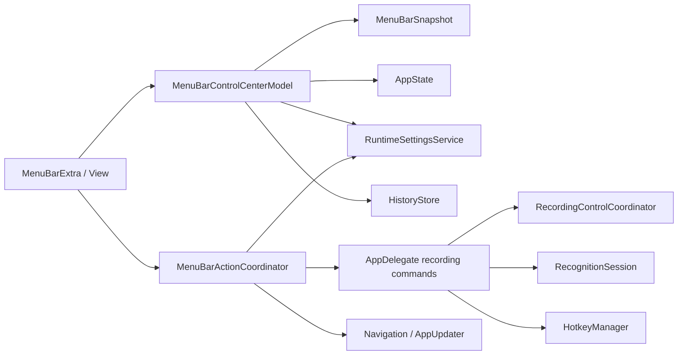

# Type4Me 菜单栏运行控制中心开发设计

> 分支：`feat/menubar-control-center`
> 文档类型：开发设计
> 文档状态：已实现（待 DEV App 实机验收）
> 对应功能设计：`docs/features/menubar-control-center/product-design.md`
> 设计日期：2026-08-23
> 最后校验：2026-08-23
> 实现基线：`09bc042c8721b5a44545c205bbb71b28539cce1c`
> 目标版本：Type4Me 2.x

## 1. 设计摘要

本功能不是复制 Settings，而是在 `MenuBarExtra` 上新增可测试的运行控制层。`RecognitionSession`、`HotkeyManager` 与 `AppState` 继续是录音和处理状态的权威来源；菜单直接启动模式必须复用热键启动链路，不能形成第二套录音状态机。

关键原则：

1. 菜单读结构化 Snapshot，View 不分散查询 Keychain、设备、History 或 updater；
2. 菜单写入已有 UserDefaults、ModeStorage、KeychainService 和设备偏好，不新增平行持久化；
3. Provider、麦克风及本地服务切换复用 Settings 的副作用，抽到共享 service/coordinator；
4. 录音开始时冻结模式、翻译目标、Provider/Model 等请求上下文；
5. 菜单启动后的注入焦点、物理热键状态和并发 Session 必须保持正确；
6. 菜单不持有长生命周期异步任务，所有任务有明确 owner、取消和刷新边界。

## 2. 当前实现基线

### 2.1 菜单与状态

`Type4Me/Type4MeApp.swift` 以 `MenuBarExtra` 挂载 `MenuBarContent`，并注入 `AppState`、`AppUpdater`。现有 `MenuBarContent` 显示状态点、遍历 `appState.availableModes`，模式点击后打开 Settings 并发出 `.navigateToMode`；其余为历史、偏好设置和退出。

`AppState` 已提供本功能的核心可观察状态：

- `barPhase`（`.hidden`、`.preparing`、`.recording`、`.processing`、`.recovering`、`.done`、`.error`）；
- `currentMode`、`availableModes`、`recordingStartDate`、`effectiveProcessingLabel`；
- `latestReviseUndoTicketID`；
- `availableUpdates`、`hasUnseenUpdate`、`isCheckingUpdate`。

禁止再创建平行的“菜单录音状态”。

菜单 View 不再渲染常驻的 `statusSection`。`.hidden` 和 `.done` 直接展示可执行动作；`.preparing` / `.recording` 以完成和取消动作表达活跃状态；`.processing` / `.recovering` 仅渲染一个由 `effectiveProcessingLabel` 驱动的紧凑 `Label`；`.error` 则在动作前渲染红色错误行。模式、识别引擎和麦克风只能在其各自的可操作菜单中呈现，避免状态摘要与控制项重复。

### 2.2 录音与控制

`AppDelegate` 拥有 `RecognitionSession`、`HotkeyManager`、`RecordingStartGate`、`RecordingControlCoordinator`、`AskAnythingCoordinator` 及 `SelectionAskController`。热键启动已经完成模式解析、Selection Ask 特殊路径、start gate、`appState.selectModeForRecording`、`appState.startRecording()`、`session.awaitIdle()` 和 `session.startRecording(mode:requestedAt:)`。

`RecordingControlCoordinator` 已使 finish/cancel 优先路由到 Selection Ask follow-up，再路由到标准录音控制。菜单的“完成录音/取消录音”必须直接复用它。

`HotkeyManager` 维护按住/切换手势、活动 binding、跨模式结束和 ESC abort；它不应被菜单伪造 binding。菜单启动时活动录音的业务真相应来自 `AppState` 与 Session，而物理键状态仍由 HotkeyManager 独占。

### 2.3 设置和数据来源

| 能力 | 当前权威来源 | 设计要求 |
| --- | --- | --- |
| ASR 选择 | `KeychainService.selectedASRProvider` + `ASRProviderRegistry` | 复用 provider-change 通知、模式协调和热键重注册 |
| 麦克风 | `AudioInputDevicePreferenceStore`、`AudioInputDeviceMonitor`、CoreAudio 默认输入 | 复用解析和回退策略，不绕过优先级存储；展示并监听实际有效的输入设备 |
| 实时文本 | `LiveTranscriptDisplayPreference` / `tf_showLiveTranscript` | 直接使用既有 key |
| 输出格式 | `TextOutputFormatter`、`ModeStorage`、相关 Preferences | 复用既有持久化与模式格式约束 |
| 翻译目标 | 翻译 `ProcessingMode` 的 ModeStorage 配置 | 通过共享写接口保存，录音时冻结 |
| 历史 | `HistoryStore` actor | 增加窄查询，不从 View 读取数据库 |
| 更新 | `AppState` + `UpdateChecker` + `AppUpdater` | 只映射状态和已有动作 |

## 3. 总体架构



职责划分：

- **View**：声明菜单层级，绑定 Snapshot 与 action；
- **Model**：把运行时状态转换为只读、可显示、无敏感正文的 Snapshot；
- **Action Coordinator**：执行菜单副作用，不让 View 直接触碰 Session、Keychain、数据库或服务生命周期；
- **AppDelegate**：继续拥有 Session、HotkeyManager 和统一录音命令。

建议新增：

```text
Type4Me/UI/MenuBar/
  MenuBarControlCenterView.swift
  MenuBarControlCenterModel.swift
  MenuBarActionCoordinator.swift
  MenuBarSnapshot.swift
  MenuBarFormatting.swift
Type4Me/Services/
  RuntimeSettingsService.swift
  ProviderAvailabilityService.swift       # 仅在现有 Registry 不足时新增
```

文件可因实现规模合并；不要继续把所有业务逻辑堆入 `Type4MeApp.swift`。

## 4. Snapshot 与 Model

### 4.1 值类型 Snapshot

```swift
struct MenuBarSnapshot: Equatable {
    var phase: FloatingBarPhase
    var statusTitle: String
    var statusSubtitle: String?
    var currentMode: MenuBarModeItem?
    var availableModes: [MenuBarModeItem]
    var recordingElapsedSeconds: Int?

    var microphone: RuntimeChoiceSnapshot
    var asrProvider: RuntimeChoiceSnapshot
    var translationTarget: RuntimeChoiceSnapshot?
    var llmProvider: RuntimeChoiceSnapshot?
    var liveTranscriptEnabled: Bool
    var outputFormatting: OutputFormattingSnapshot
    var recordingFeedback: RecordingFeedbackSnapshot

    var canReviseLatest: Bool
    var canUndoRevise: Bool
    var canCopyLatestResult: Bool
    var permissionIssue: PermissionIssue?
    var update: MenuBarUpdateSnapshot?
}

struct MenuBarModeItem: Identifiable, Equatable {
    let id: UUID
    let name: String
    let hotkeySummary: String?
    let executionKind: ProcessingMode.ExecutionKind
    let translationTargetName: String?
}
```

Snapshot 只保存菜单可展示的值；不得保存 API Key、历史正文、剪贴板正文、Ask Anything 内容或复杂服务对象。快捷键文本统一复用 `HotkeyRecorderView.keyDisplayName`，或先抽出一个无 View 依赖的 formatter。

### 4.2 `MenuBarControlCenterModel`

建议实现为 `@MainActor @Observable final class`，由 `AppDelegate` 在应用启动时创建并注入 `MenuBarContent`，生命周期与应用一致而不是每次展开菜单新建。

职责：从 AppState 派生状态文案和模式列表；刷新设备、Provider、权限、更新与历史可复制标记；监听模式、Provider、设备和 History 通知；在异步查询完成后原子更新 Snapshot。它不负责开始/结束录音、写凭证、切 Provider 服务、注入文本或打开窗口。

刷新需去重：对设备事件和 UserDefaults 变化 debounce；History 只更新 `canCopyLatestResult`，不拉取正文；model deinit 时取消通知和任务。用显式领域通知优先于监听全部 `UserDefaults.didChangeNotification`。

## 5. Action Coordinator 与统一录音命令

### 5.1 接口

```swift
@MainActor
final class MenuBarActionCoordinator {
    func startRecording(modeID: UUID)
    func finishRecording()
    func cancelRecording()
    func setMicrophone(_ choice: MicrophoneChoice)
    func setASRProvider(_ provider: ASRProvider)
    func setTranslationTarget(_ language: TranslationLanguage)
    func setLiveTranscript(_ enabled: Bool)
    func setPunctuationMode(_ mode: ModePunctuationMode)
    func setCJKSpacing(_ mode: CJKSpacingMode)
    func setCornerQuotes(_ enabled: Bool)
    func setCopyToClipboard(_ enabled: Bool)
    func copyLatestResult()
    func startRevise()
    func undoLatestRevise()
    func openAskAnything()
    func openVocabulary()
    func openHistory()
    func openType4Me()
    func openSettings()
    func openPermissionGuide()
    func performUpdateAction()
}
```

`MicrophoneChoice` 是本功能新增的轻量值类型：它只表达“跟随系统”或某个 `AudioInputDevice`，不替代既有的麦克风优先级模型。

它可通过闭包或弱引用请求 AppDelegate 操作，但不复制 AppDelegate 的 Session ownership。动作失败应写本地诊断日志并给出非阻塞 UI 反馈；日志只记录动作和稳定 ID，不记录文本。

### 5.2 提取统一启动入口

当前热键 `onStart` 包含关键竞态保护。菜单不得复制伪代码；应把现有语义原样提取为 AppDelegate 的共享命令，例如：

```swift
enum RecordingStartSource: String { case hotkey, menuBar, followUp }

@MainActor
func requestRecordingStart(modeID: UUID, source: RecordingStartSource) {
    // 1. 拒绝 .preparing/.recording/.processing 的不合法并发启动
    // 2. 从 availableModes 解析并用 ASRProviderRegistry 解析有效模式
    // 3. 处理 Selection Ask 新问题准备
    // 4. 申请 RecordingStartGate token，记录 requestedAt
    // 5. 选择模式并调用 AppState.startRecording()
    // 6. Task 中 await session.awaitIdle()
    // 7. 回到 MainActor 验证 token 后调用 session.startRecording(...)
}
```

热键改为调用 `requestRecordingStart(..., source: .hotkey)`，菜单调用 `.menuBar`。原始的恢复、Selection Ask follow-up 和错误清理分支必须保留；实现时应以现有路径抽取而不是重新解释其语义。

### 5.3 菜单启动与 HotkeyManager

不要创建假的 `HotkeyBinding` 或写入假的 active binding。必须给 HotkeyManager 一个共享的“外部录音是否活跃”判断（推荐由 AppDelegate/Session 状态提供），避免菜单启动后用户按切换式热键又启动第二轮。菜单以 A 开始、用户按 B 时须保留既有 cross-mode finish 偏好：关闭时以 A 处理，开启时按既有规则以 B 完成处理；永不并行启动。ESC 应继续走当前 abort 路由。

### 5.4 完成与取消

`finishRecording()` 和 `cancelRecording()` 调用 `RecordingControlCoordinator.perform(.finish/.cancel)`。绝不在 Menu View 中直接调 `AppState.stopRecording` 或 `RecognitionSession`，以免绕过 Selection Ask 和热键清理。

## 6. 设置副作用与运行时一致性

### 6.1 `RuntimeSettingsService`

Settings 和菜单若各自写 Preference，会丢失 Provider 重启、模式协调、热键重注册、缓存失效和 UI 刷新。将目前散落在 Settings Action 中的“读写 + 业务副作用”收敛为共享 service；Settings 改为调用它，菜单也调用它。

每个写动作先检查当前阶段：录音中会污染本轮的项拒绝或只读；处理中允许下一轮修改时，Snapshot 显示“下一轮生效”。写入失败须保持旧状态，并刷新 Snapshot 反映真实值。

### 6.2 麦克风

读取 `AudioInputDeviceMonitor` 和 `AudioInputDevicePreferenceStore`。菜单的“跟随系统”调用现有 reset；具体设备写入一个受控的单项优先级而不直接改变捕获引擎。设备变化通知后重新解析结果；设备不在列表时回退，菜单显示解析后的实际设备。录音开始后禁用选择。

`AudioInputDeviceMonitor` 除输入设备列表外，还缓存 CoreAudio `kAudioHardwarePropertyDefaultInputDevice` 解析出的 UID、名称与类别，并监听该 property 与设备列表变化。`activeInputDevice(devices:systemDefault:)` 是唯一的有效设备决策：优先模式取第一个在线优先项，否则回退系统默认输入；跟随系统直接取系统默认输入。Menu 的勾选状态仍表达用户偏好，实际设备名称仅作状态说明，避免“跟随系统”和某个物理设备同时被勾选。

`AppDelegate` 对设备拓扑和设备偏好通知建立启动基线，并仅在 effective UID 改变时调用 `AppState.showTransientNotification`。`AppState` 复用既有 `.done` 浮动条反馈；忙碌时将最新设备消息排队，在会话完成、取消或自动隐藏后呈现，绝不覆盖录音/处理 UI。该机制是应用内反馈，不接入 macOS 系统通知。

### 6.3 ASR Provider

可选项为 `ASRProviderRegistry.capabilities(for:)` 可用且已经有完整所需配置的 Provider，加上不需要用户凭证的有效 Provider。切换需在统一操作中完成：保存 `KeychainService.selectedASRProvider`、启动/停止本地服务、调用现有 `refreshModeAvailability()` 语义、更新 follow-up 快捷键提示并重新注册热键。若失败，恢复前一 Provider 并报告；不能只写 `UserDefaults`。

SenseVoice/Qwen3 菜单必须 `#if HAS_SHERPA_ONNX`，并遵守 `SenseVoiceServerManager` 生命周期。pure build 不引用 local-only API。

### 6.4 翻译与输出格式

翻译目标经 ModeStorage 的共享写接口更新，避免 UI 直接改 JSON 后内存列表滞后。`AppState.availableModes` 更新后发送 `.modesDidChange`。录音请求使用开始时捕获的 `ProcessingMode`/请求上下文，保证后续修改不污染请求。

实时文本直接更新 `LiveTranscriptDisplayPreference.storageKey`；CJK 间距、直角引号和保留剪贴板沿用 `TextOutputFormatter` 与现有 Preference key；当前模式标点仅在 `supportsOutputFormatting` 时显示并通过 ModeStorage 保存。对可能影响最终文字的项，录音中锁定，处理阶段明确作为下一轮设置。

## 7. History、Revise、导航、权限与更新

### 7.1 History 与复制

在 `HistoryStore` 增加窄接口，例如 `func latestCopyableFinalText() -> String?`。SQL 层负责排除空、取消和失败记录；最终文本选择逻辑只存在一处。Model 异步调用它来更新可用状态，Coordinator 再次查询并以 `NSPasteboard.general` 写入，避免把正文缓存入 Snapshot。复制后短时反馈由 Model 控制，不能记录正文。

### 7.2 Revise

撤销直接使用 `AppState.latestReviseUndoTicketID` 和已有 `onReviseUndo` 路由。开始改口必须复用 AppDelegate 中 revise hotkey 的预处理、目标解析、start gate 与 `session.startReviseRecording`，不能用普通模式启动替代。

### 7.3 Settings 导航

Coordinator 使用现有 `openWindow(id: "settings")` 和 `AppNavigationModel`/通知。应用级入口不恢复上次标签：`openType4Me()` 先设置 `selectedTab = .general`，`openSettings()` 先设置 `selectedTab = .preferences`。History、Vocabulary 和 Modes 分别设为自己的目标标签；Ask Anything 设置 `navigationModel.selectedTab = .askAnything` 并遵守其活动会话语义。导航前激活应用，避免打开后台窗口。

### 7.4 权限与更新

权限 Snapshot 汇总麦克风和 Accessibility，按“阻断录音 > 会阻断注入 > 非阻断”排序。动作复用 `PermissionGuideView` 或当前系统授权流，菜单不自行复制授权代码。

更新 Snapshot 映射 `appState.availableUpdates`、`isCheckingUpdate` 和 `AppUpdater` 的下载/安装状态；下载、取消和安装重启调用已有 updater API。没有更新且没有进行中任务时返回 `nil`。

## 8. SwiftUI、并发与焦点

保留原生 `MenuBarExtra`。菜单 View 仅消费 `@Observable` model，以 `Menu`、`Button`、`Toggle`、`Divider` 组成；不要通过每次 body 计算执行磁盘、数据库或设备 I/O。录音计时由 `recordingStartDate` 派生，使用轻量定时刷新；菜单关闭后不得继续保留无主计时任务。

菜单点击会让 Type4Me 短暂成为前台应用，存在最终文本被注入自身的风险。录音启动前必须沿用/补齐当前注入目标捕获策略：在打开菜单之前或在开始时捕获前台非 Type4Me 应用及 focused element；完成时验证目标仍可写，否则使用现有安全回退（如剪贴板或错误反馈）。不得为方便菜单启动而注入到当前激活的 Settings 窗口。

所有 UI、AppState、Coordinator 和 Snapshot 变更在 `@MainActor`；`RecognitionSession`、`HistoryStore` 等 actor 调用使用 `Task` 和 `await`。每个 Task 需要持有者：Model 的刷新任务在 deinit/新刷新时取消；录音启动仍由 AppDelegate gate 控制；View 不保存 Session Task。避免在 MainActor 等待数据库或网络。

## 9. 测试计划

### 9.1 单元测试

- `MenuBarSnapshot`：各 `barPhase` 的标题、可见项、只读规则、隐私字段缺失；
- 模式项：多快捷键格式、翻译目标摘要、无绑定展示；
- `requestRecordingStart`：normal、Selection Ask、busy、awaitIdle 超时、stale gate、菜单与热键共享语义；
- 菜单启动后热键按下、cross-mode finish 和 ESC 的回归；
- `RuntimeSettingsService`：Provider 成功/回滚、模式重协调、设备回退、翻译/格式持久化；
- `HistoryStore.latestCopyableFinalText`：空、失败、取消、修订后和无记录；
- 权限与更新 Snapshot 的优先级和条件显示。

### 9.2 UI/手工验收

- 原生菜单键盘导航、中文/英文、本地/pure build；
- 菜单开始录音后浮动条、注入焦点和历史一致；
- 蓝牙连接/断开、Provider 切换、本地服务启动失败；
- 录音中与处理中修改“下一轮设置”的显示和冻结行为；
- 无权限、无历史、无改口、无更新、单 LLM 配置等空状态；
- 观察菜单、截图和日志，确认不出现正文、剪贴板或凭证。

## 10. 实施顺序与风险

1. 先抽取统一录音启动/结束命令，并为菜单启动与 HotkeyManager 交互补回归测试；
2. 引入 Snapshot、Model、Coordinator，先替换状态与模式直接启动；
3. 加入导航、历史复制和权限/更新；
4. 将麦克风、ASR、翻译目标和输出格式副作用收敛到共享 service；
5. 最后增加 P1 的反馈、LLM 和本地双引擎快捷控制。

最高风险是重复启动状态机、菜单失焦导致错误注入、Provider 切换只保存未生效、以及菜单启动后物理 toggle 热键状态不同步。每一步都必须保留现有录音路径为唯一事实来源，以定向测试和完整 Swift test suite 验证后再扩展菜单项。

## 11. P0 实现记录

P0 将 View、Model 和 Action Coordinator 合并在 `Type4Me/UI/MenuBar/MenuBarControlCenter.swift`：View 直接观察已注入的 `AppState`（录音权威状态），Model 只维护设备、可用 Provider、权限、改口及 History 可用性等外部快照，Coordinator 统一承接菜单副作用。

`AppDelegate` 现在提供共享的普通录音/改口启动命令；热键与菜单栏调用同一条命令，并继续保留原有 Selection Ask、恢复、start gate、`awaitIdle` 和 Session 路由。History 使用窄查询 `latestCopyableFinalText()`，正文只在复制动作的一次性 actor 查询中出现，不进入菜单 Model。
